# Lehrer:innen-Handbuch zur Mitarbeitsbewertung

Dieses Handbuch richtet sich ausschließlich an Lehrkräfte in der Rolle **Lehrer:in**. Es beschreibt die tägliche Arbeit mit **COOL-Grades** aus Sicht des Unterrichtsalltags.

Beschrieben werden nur Funktionen, die Lehrkräfte selbst sehen und nutzen können. Admin-Themen wie Benutzerverwaltung, Klassenverwaltung, Fachanlage, globale Systemeinstellungen, Datenbank, Server oder Backups gehören bewusst nicht in dieses Handbuch.

## 1. Einführung

### Zweck der Software

COOL-Grades unterstützt Lehrkräfte dabei, fachlich relevante Leistungen über das Semester hinweg knapp, nachvollziehbar und auswertbar zu dokumentieren. Die App verbindet drei Arbeitsfelder:

- **laufende Mitarbeit**
- **besondere mündliche Leistungsfeststellungen**
- **besondere schriftliche Leistungsfeststellungen**

Aus diesen Einträgen entsteht später eine übersichtliche Auswertung als **pädagogische Entscheidungshilfe**.

### Was die Software leisten soll

Die App soll Lehrkräften helfen,

- Beobachtungen zeitnah festzuhalten,
- typische Unterrichtssituationen mit wenigen Klicks zu dokumentieren,
- besondere Leistungen getrennt von der laufenden Mitarbeit zu erfassen,
- am Ende eines Zeitraums schneller zu einer nachvollziehbaren Einschätzung zu kommen,
- und diese Einschätzung in einer strukturierten Webansicht oder als PDF zu nutzen.

### Was die Software nicht leisten soll

Die App trifft **keine automatische Endbeurteilung**. Sie ersetzt weder den Lehrplan noch die professionelle Gesamtentscheidung der Lehrkraft.

Wichtig ist vor allem:

- Ein einzelner Mitarbeitseintrag ist **keine Einzelnote**.
- Die Auswertung ist **keine Black Box**, sondern eine begründete Zusammenfassung vorhandener Einträge.
- Die endgültige Leistungsbeurteilung bleibt immer bei der Lehrkraft.

### Unterschied zwischen Mitarbeit, besonderen Leistungen und Auswertung

**Mitarbeit** ist für die laufende Dokumentation aus dem Unterricht gedacht. Hier werden typische Situationen wie Beteiligung, Sicherung, Arbeitsauftrag, Gruppenarbeit oder Hausübung knapp festgehalten.

**Besondere mündliche Leistungsfeststellungen** und **besondere schriftliche Leistungsfeststellungen** bilden formellere Leistungssituationen ab. Sie werden getrennt geführt, damit im Rückblick erkennbar bleibt, worauf sich eine Beobachtung oder Bewertung bezieht.

**Auswertungen** fassen die gespeicherten Einträge später pro Schüler:in zusammen. Sie zeigen Datenlage, Tendenzen, besondere Leistungen und einen transparenten Notenvorschlag für die Mitarbeit. Die Auswertung unterstützt die Beurteilung, legt sie aber nicht endgültig fest.

## 2. Erste Orientierung in der App

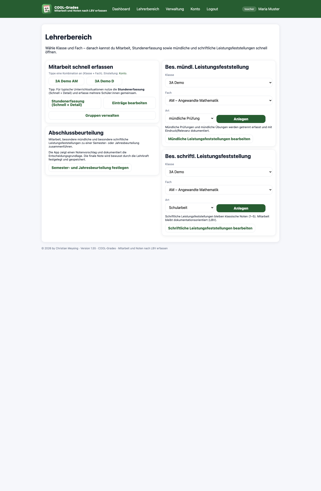

### Dashboard und Hauptnavigation

Nach dem Login landen Lehrkräfte im Regelfall auf dem **Dashboard**. Von dort führen die wichtigsten Wege in vier Bereiche:

- **Lehrerbereich**
- **Auswertungen**
- **Verwaltung**
- **Konto**

### Wozu dient welcher Bereich?

### Lehrerbereich

Der **Lehrerbereich** ist der Arbeitsbereich für den Unterrichtsalltag. Hier werden Einträge erstellt, Stunden angelegt, besondere Leistungen erfasst und bestehende Mitarbeitseinträge bearbeitet.

Typische Nutzung:

- während oder kurz nach dem Unterricht
- beim Nachtragen einzelner Beobachtungen
- beim Erfassen von Tests, mündlichen Prüfungen oder Übungen

Auswirkung auf Daten:

- In diesem Bereich entstehen und ändern sich die eigentlichen Leistungsdokumentationen.

### Auswertungen

Der Bereich **Auswertungen** bündelt bereits gespeicherte Daten. Hier werden keine Leistungen neu erfasst, sondern vorhandene Daten gefiltert, gelesen, interpretiert und als PDF ausgegeben.

Typische Nutzung:

- vor Sprechtagen
- vor pädagogischen Konferenzen
- vor Semester- oder Jahresbeurteilungen

Auswirkung auf Daten:

- Filter und Anzeigen verändern keine Daten.
- Nur die sichtbare Auswertung und der PDF-Inhalt hängen von den gewählten Filtern ab.

### Verwaltung

Unter **Verwaltung** pflegen Lehrkräfte ihre **eigene Arbeitsumgebung**. Dazu gehören Kriterien, Picklisten, Presets und Gruppen.

Typische Nutzung:

- vor dem ersten Einsatz
- wenn häufig wiederkehrende Unterrichtssituationen vorbereitet werden sollen
- wenn die Eingabe schneller und einheitlicher werden soll

Auswirkung auf Daten:

- Verwaltungseinträge beeinflussen vor allem **künftige Eingaben**.
- Sie schaffen Struktur und sparen Zeit, sind aber nicht selbst schon eine Bewertung.

### Konto

Im Bereich **Konto** wird die persönliche Darstellung und Arbeitsweise eingestellt, zum Beispiel Theme, Kompaktansicht, vereinfachte Mitarbeitserfassung oder Quick-Pick.

Auswirkung auf Daten:

- Die meisten Konto-Einstellungen ändern nur die **persönliche Ansicht**.
- Einige Einstellungen beeinflussen, **welche Felder beim Erfassen sichtbar sind**.
- Bereits gespeicherte Daten werden durch Konto-Einstellungen nicht rückwirkend verändert.

### Typische Arbeitsweise einer Lehrkraft

Im Schulalltag sieht ein realistischer Ablauf meist so aus:

1. Im **Konto** die persönliche Darstellung kurz passend einstellen.
2. Unter **Verwaltung** bei Bedarf Kriterien, Picklisten, Presets oder Gruppen vorbereiten.
3. Im **Lehrerbereich** Stunden anlegen oder direkt Mitarbeit erfassen.
4. Besondere mündliche oder schriftliche Leistungen separat dokumentieren.
5. Vor Semesterende im Bereich **Auswertungen** die Tendenzen pro Schüler:in prüfen und als PDF nutzen.

## 3. Kontoeinstellungen und persönliche Startkonfiguration

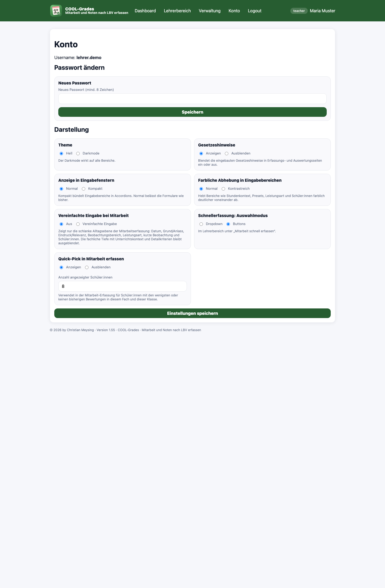

Die Kontoeinstellungen betreffen die **persönliche Arbeitsumgebung**. Sie können in der Regel jederzeit geändert werden. Sie verändern keine bereits gespeicherten Bewertungen.

### Passwort ändern

- **Wo finde ich die Einstellung?**
  Im Bereich **Konto**.
- **Welche Auswahlmöglichkeiten gibt es?**
  Es wird ein neues Passwort gesetzt.
- **Was bewirkt die Einstellung?**
  Sie schützt den Zugang zum eigenen Lehrer:innen-Konto.
- **Betrifft sie nur meine persönliche Ansicht oder auch gespeicherte Daten?**
  Weder noch. Sie betrifft nur den Zugang zum Konto.
- **Kann ich sie später ändern?**
  Ja.
- **Empfehlung für den Start**
  Das Passwort gleich beim ersten Einsatz prüfen und bei Bedarf ändern.

### Theme: Hell / Dunkel

- **Wo finde ich die Einstellung?**
  Im Bereich **Konto** unter den persönlichen Anzeigeoptionen.
- **Welche Auswahlmöglichkeiten gibt es?**
  `Hell` und `Darkmode`.
- **Was bewirkt die Einstellung?**
  Sie ändert das Erscheinungsbild der App.
  `Hell` zeigt die App mit hellem Hintergrund und dunkler Schrift.
  `Darkmode` zeigt die App mit dunklem Hintergrund und heller Schrift.
- **Betrifft sie nur meine persönliche Ansicht oder auch gespeicherte Daten?**
  Nur die persönliche Ansicht.
- **Hat die Einstellung Auswirkungen auf Erfassung, Auswertung oder PDF-Export?**
  Nein. Daten, Auswertungslogik und PDF-Inhalte bleiben gleich.
- **Kann ich sie später ändern?**
  Ja, jederzeit.
- **Empfehlung für den Start**
  Wählen Sie die Darstellung, mit der Sie am Bildschirm länger angenehm arbeiten können.

### Gesetzeshinweise: Anzeigen / Ausblenden

- **Wo finde ich die Einstellung?**
  Im Bereich **Konto**.
- **Welche Auswahlmöglichkeiten gibt es?**
  `Anzeigen` oder `Ausblenden`.
- **Was bewirkt die Einstellung?**
  Zusätzliche rechtliche Kurzinfos und LBV-Hinweise werden auf mehreren Lehrer:innen-Seiten ein- oder ausgeblendet, zum Beispiel bei Mitarbeit, Auswertungen, mündlichen und schriftlichen Leistungsfeststellungen.
- **Betrifft sie nur meine persönliche Ansicht oder auch gespeicherte Daten?**
  Nur die persönliche Ansicht.
- **Hat die Einstellung Auswirkungen auf Erfassung, Auswertung oder PDF-Export?**
  Sie verändert keine Daten und keine Berechnung. Sie wirkt nur auf die sichtbaren Hinweisblöcke in der Weboberfläche. Der rechtliche Hinweis im PDF ist davon nicht abhängig.
- **Kann ich sie später ändern?**
  Ja.
- **Empfehlung für den Start**
  Für neue Nutzer:innen ist `Anzeigen` sinnvoll, weil die App damit ihre pädagogische und rechtliche Logik besser erklärt.

### Anzeige in Eingabefenstern: Normal / Kompakt

- **Wo finde ich die Einstellung?**
  Im Bereich **Konto**.
- **Welche Auswahlmöglichkeiten gibt es?**
  `Normal` und `Kompakt`.
- **Was bewirkt die Einstellung?**
  `Normal` zeigt Formulare offener und ausführlicher.
  `Kompakt` arbeitet stärker mit Accordions und zusammenklappbaren Bereichen. Das spart Platz und macht lange Formulare übersichtlicher.
- **Betrifft sie nur meine persönliche Ansicht oder auch gespeicherte Daten?**
  Nur die Darstellung der Eingabemasken.
- **Hat die Einstellung Auswirkungen auf spätere Auswertungen oder PDF-Exporte?**
  Nein.
- **Kann ich sie später ändern?**
  Ja.
- **Empfehlung für den Start**
  Für den ersten Einstieg ist `Normal` meist leichter. Wer häufiger am Tablet oder auf kleineren Bildschirmen arbeitet, profitiert oft von `Kompakt`.

### Farbliche Abhebung in Eingabebereichen: Normal / Kontrastreich

- **Wo finde ich die Einstellung?**
  Im Bereich **Konto**.
- **Welche Auswahlmöglichkeiten gibt es?**
  `Normal` und `Kontrastreich`.
- **Was bewirkt die Einstellung?**
  `Kontrastreich` trennt Eingabeblöcke farblich stärker. Das hilft besonders in längeren Formularen wie Mitarbeit, Stundenerfassung oder Gruppenverwaltung, weil Bereiche wie Auswahl, Leistungsart, Unterrichtskontext und Schüler:innen deutlicher auseinandergehalten werden.
- **Betrifft sie nur meine persönliche Ansicht oder auch gespeicherte Daten?**
  Nur die Darstellung.
- **Hat die Einstellung Auswirkungen auf Erfassung, Auswertung oder PDF-Export?**
  Keine fachliche Auswirkung. Sie hilft nur beim Arbeiten in der Weboberfläche.
- **Kann ich sie später ändern?**
  Ja.
- **Empfehlung für den Start**
  `Kontrastreich` ist für viele Lehrkräfte angenehmer, wenn sie im Unterricht schnell zwischen mehreren Bereichen wechseln.

### Vereinfachte Eingabe bei Mitarbeit

- **Wo finde ich die Einstellung?**
  Im Bereich **Konto**.
- **Welche Auswahlmöglichkeiten gibt es?**
  `Aus` und `Vereinfachte Eingabe`.
- **Was bewirkt die Einstellung?**
  In der vereinfachten Eingabe konzentriert sich das Formular auf die Alltagsebene:
  Datum, Grund/Anlass, Eindruck/Relevanz, Beobachtungsbereich, Leistungsart, kurze Beobachtung und Schüler:innen.
  Tiefer liegende Bereiche wie Unterrichtskontext und die fachliche Kriterienauswahl werden ausgeblendet.
- **Betrifft sie nur meine persönliche Ansicht oder auch gespeicherte Daten?**
  Sie betrifft vor allem die sichtbaren Felder und damit die praktische Erfassung. Bereits gespeicherte Daten bleiben unverändert.
- **Hat die Einstellung Auswirkungen auf spätere Auswertungen?**
  Indirekt ja: Wenn weniger Felder sichtbar sind, werden im Alltag oft bewusst knappere Einträge erfasst. Die Auswertung bleibt möglich, enthält dann aber weniger Tiefendetails.
- **Hat die Einstellung Auswirkungen auf PDF-Exporte?**
  Nur indirekt über die tatsächlich gespeicherten Daten.
- **Kann ich sie später ändern?**
  Ja.
- **Empfehlung für den Start**
  Für viele Lehrkräfte ist die vereinfachte Eingabe ein guter Einstieg. Wer im Fach sehr differenziert dokumentieren möchte, kann später auf die volle Ansicht wechseln.

### Schnellerfassung: Auswahlmodus

- **Wo finde ich die Einstellung?**
  Im Bereich **Konto**.
- **Welche Auswahlmöglichkeiten gibt es?**
  `Dropdown` oder `Buttons`.
- **Was bewirkt die Einstellung?**
  Sie verändert im Lehrerbereich die Auswahl von Klasse und Fach für die Schnell-Mitarbeitserfassung.
  `Buttons` ist schneller, wenn es nur wenige Klasse-Fach-Kombinationen gibt.
  `Dropdown` ist platzsparender und meist besser, wenn viele Kombinationen vorhanden sind.
- **Betrifft sie nur meine persönliche Ansicht oder auch gespeicherte Daten?**
  Nur die Bedienform im Einstieg.
- **Hat die Einstellung Auswirkungen auf Auswertung oder PDF?**
  Nein.
- **Kann ich sie später ändern?**
  Ja.
- **Empfehlung für den Start**
  Bei wenigen Fächern sind `Buttons` sehr praktisch. Bei vielen Kombinationen ist `Dropdown` meist übersichtlicher.

### Quick-Pick in Mitarbeit erfassen

- **Wo finde ich die Einstellung?**
  Im Bereich **Konto**.
- **Welche Auswahlmöglichkeiten gibt es?**
  `Anzeigen` oder `Ausblenden` sowie eine Anzahl der Vorschläge.
- **Was bewirkt die Einstellung?**
  Der Quick-Pick schlägt in der Mitarbeitserfassung Schüler:innen vor, damit die Auswahl schneller geht. Die Vorschläge orientieren sich an der bisherigen Erfassung und rotieren bei gleichen Ständen, damit nicht immer dieselben Namen zuerst erscheinen.
- **Betrifft sie nur meine persönliche Ansicht oder auch gespeicherte Daten?**
  Nur die Auswahlhilfe im Formular.
- **Hat die Einstellung Auswirkungen auf Auswertung oder PDF?**
  Nicht direkt. Sie beeinflusst nicht die Berechnung, sondern nur die Geschwindigkeit und Fairness der Auswahl im Alltag.
- **Kann ich sie später ändern?**
  Ja.
- **Empfehlung für den Start**
  Quick-Pick eingeschaltet lassen und mit einer mittleren Anzahl starten, zum Beispiel 8 bis 12 Vorschläge.

### Empfehlung für neue Nutzer:innen: So starten Sie am einfachsten

Für den Einstieg hat sich diese Kombination bewährt:

1. `Gesetzeshinweise` auf `Anzeigen`
2. `Anzeige in Eingabefenstern` auf `Normal`
3. `Farbliche Abhebung` auf `Kontrastreich`
4. `Vereinfachte Eingabe bei Mitarbeit` einschalten
5. `Quick-Pick` einschalten

Damit ist die Oberfläche klar, aber noch nicht überladen.

## 4. Schnell-Mitarbeitserfassung

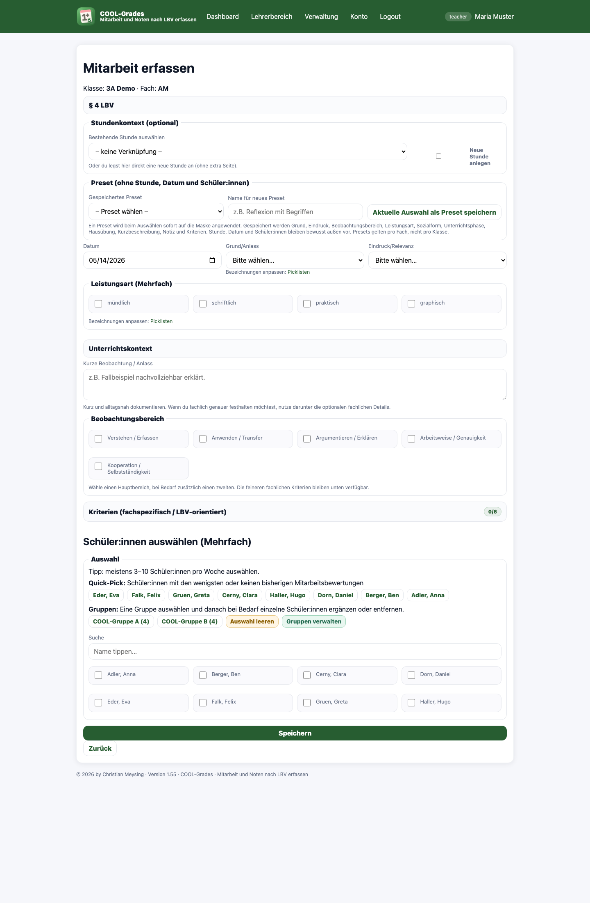

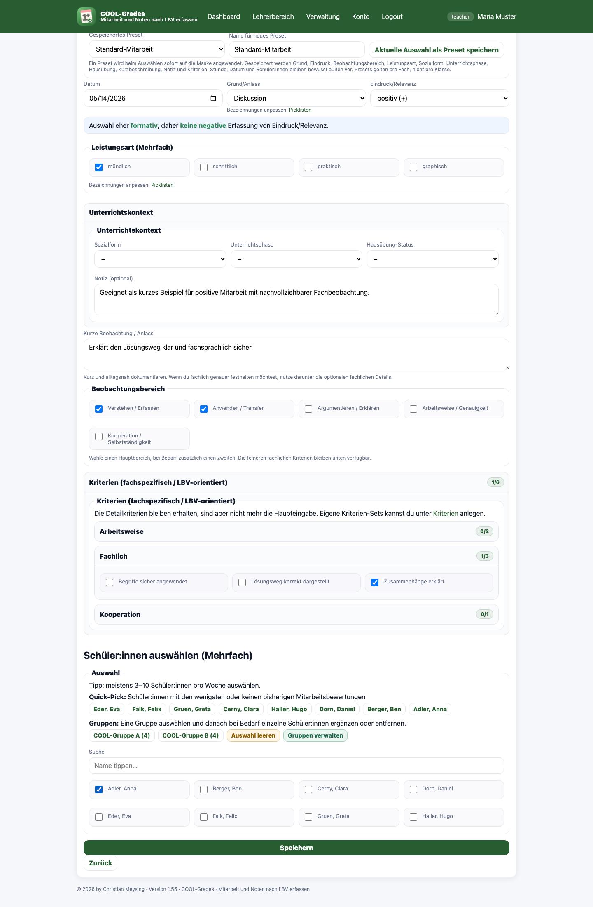

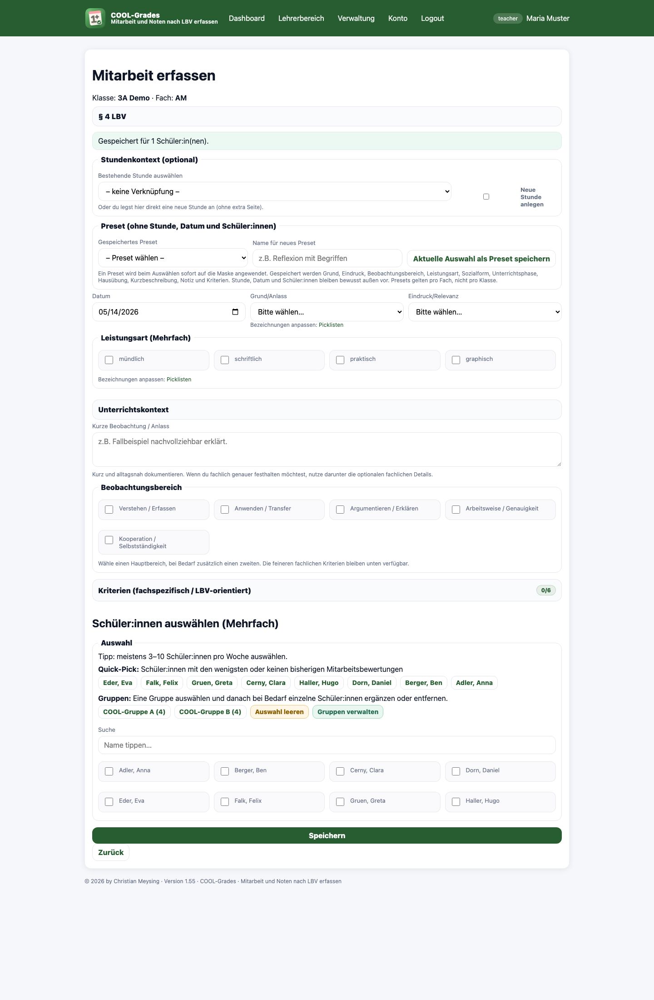

### Wann wird dieser Bereich verwendet?

Die Schnell-Mitarbeitserfassung ist für die **laufende Unterrichtsdokumentation** gedacht. Sie eignet sich besonders, wenn Sie während oder kurz nach einer Stunde festhalten möchten,

- wer sich fachlich beteiligt hat,
- wie sicher oder unsicher ein Beitrag war,
- welche Form der Leistung sichtbar wurde,
- und ob es eine kurze Notiz zur Situation braucht.

Sie ist **nicht** für Schularbeiten, Tests oder formellere Sonderleistungen gedacht. Dafür gibt es eigene Bereiche.

### Typischer Ablauf

1. Klasse und Fach im Lehrerbereich auswählen
2. falls gewünscht eine Stunde anlegen oder übernehmen
3. Datum prüfen
4. Grund/Anlass wählen
5. Eindruck/Relevanz festlegen
6. Leistungsart und Beobachtungsbereich wählen
7. kurze Beobachtung eintragen
8. Schüler:innen auswählen
9. speichern

### Klasse und Fach auswählen

Die Auswahl von Klasse und Fach passiert meist schon vor dem Öffnen der Seite im Lehrerbereich.

Wirkung:

- Sie legt fest, für **welche Lerngruppe** und **welchen Unterrichtsgegenstand** der Eintrag gespeichert wird.
- Sie bestimmt außerdem, welche Schüler:innen, Picklisten, Kriterien, Presets und Gruppen auf der Seite angeboten werden.

Fehler vermeiden:

- Vor dem Eintragen immer kurz prüfen, ob wirklich das richtige Fach geöffnet wurde.
- Ein späterer Fachwechsel ist möglich, aber unnötige Korrekturen kosten Zeit und verändern spätere Auswertungen.

### Stundenkontext (optional)

Der Stundenkontext verknüpft einen Mitarbeitseintrag mit einer bereits angelegten Unterrichtsstunde.

Wirkung:

- Datum, UE/Stunde und Thema sind dadurch später besser nachvollziehbar.
- In Eintragslisten und Auswertungen lässt sich leichter erkennen, aus welcher Stunde eine Beobachtung stammt.

Wann sinnvoll?

- wenn Sie mehrere Beobachtungen in derselben Stunde dokumentieren
- wenn UE/Thema später im Rückblick wichtig sein sollen

Wann nicht zwingend nötig?

- bei sehr knappen Alltagseinträgen, wenn nur das Datum relevant ist

Auswirkung auf Auswertung und PDF:

- Der Stundenbezug erscheint in Detailansichten und verbessert die Nachvollziehbarkeit, verändert aber nicht die positive oder negative Zählung.

### Preset

Presets stehen in der vollen Mitarbeitsansicht zur Verfügung.

Wirkung:

- Ein Preset füllt typische Felder mit einem Schritt vor.
- Es speichert **keine** Bewertung automatisch ab.
- Es bereitet nur das Formular vor.

Typisch vorausgefüllt werden:

- Grund/Anlass
- Eindruck/Relevanz
- Beobachtungsbereiche
- Leistungsarten
- Unterrichtskontext
- Kriterien
- kurze Textbausteine

Nicht automatisch festgelegt werden in der Regel:

- Datum
- konkrete Schüler:innen
- konkrete Stunde

Wann sinnvoll?

- bei wiederkehrenden Situationen wie Gruppenarbeit, Hausübung, Präsentation oder schriftlichem Arbeitsauftrag

Auswirkung auf spätere Auswertungen:

- indirekt, weil durch ein Preset oft konsistenter und schneller dokumentiert wird

### Datum

Das Datum legt fest, **wann** die Beobachtung stattgefunden hat.

Wirkung:

- Das Datum entscheidet darüber, in welchem Zeitraum der Eintrag später in Auswertungen und PDFs erscheint.
- Es ist auch für die Datenlage wichtig, weil die App nicht nur Einträge zählt, sondern auch unterschiedliche dokumentierte Tage berücksichtigt.

Fehler vermeiden:

- Das Datum möglichst gleich nach dem Unterricht prüfen.
- Ein falsches Datum kann dazu führen, dass ein Eintrag in der späteren Auswertung scheinbar „fehlt“.

### Grund/Anlass

Der Grund oder Anlass beschreibt die konkrete Unterrichtssituation, in der eine Leistung sichtbar wurde, zum Beispiel:

- Sicherung
- Diskussion
- Hausübung
- Arbeitsauftrag
- Gruppenarbeit

Wirkung:

- Der Anlass macht den Eintrag inhaltlich verständlicher.
- Er unterstützt die spätere Interpretation in der Detailansicht.
- Je nach hinterlegter Picklisten-Einstellung kann er passende Beobachtungsbereiche vorschlagen.
- Er kann außerdem den kurzen pädagogischen Hinweis im Formular beeinflussen, ob die Situation eher formativ oder eher bilanzierend wirkt.

Wichtig:

- Der Anlass **ändert nicht automatisch** die Bewertung.
- Er hilft bei der fachlichen Einordnung.

### Eindruck/Relevanz

Der Eindruck beschreibt die fachliche Tendenz der Beobachtung.

Wirkung in der Auswertung:

- `positiv (+)` wird als **positive** Beobachtung gezählt
- `neutral` wird als **neutrale** Beobachtung gezählt
- `negativ (-)` wird als **negative** Beobachtung gezählt

Pädagogische Bedeutung:

- **positiv (+)**: fachlich gelungener, sicherer oder hilfreicher Beitrag
- **neutral**: Beobachtung ohne klare positive oder negative Tendenz
- **negativ (-)**: fachlich relevante Schwierigkeit, fehlende Leistung oder unsicherer Beitrag in einer konkreten Situation

Wichtig:

- Ein einzelner Eindruck ist **keine Einzelnote**.
- Die Wirkung entsteht erst in der späteren Gesamtschau über mehrere Einträge.

Hinweisbox formativ / summativ:

Direkt bei diesem Feld zeigt die App einen kurzen Orientierungshinweis an. Er wird aus Anlass und Unterrichtskontext abgeleitet und soll helfen, die Auswahl von `Eindruck/Relevanz` pädagogisch einzuordnen.

Beispiel:

- Bei eher lernbegleitenden Situationen warnt die App davor, leichtfertig negativ zu dokumentieren.
- Bei eher bilanzierenden Situationen weist sie darauf hin, dass eine negative Erfassung grundsätzlich möglich ist.

Wirkung dieses Hinweises:

- Er ist eine **Orientierungshilfe**, keine zusätzliche Note und kein eigener gespeicherter Bewertungstyp.

### Leistungsart (Mehrfach)

Hier wird ausgewählt, in welcher Form die Leistung sichtbar wurde. Mehrfachauswahl ist möglich.

Wirkung:

- Die Leistungsart beschreibt **wie** die Leistung gezeigt wurde.
- Sie ergänzt den Anlass und den Beobachtungsbereich.
- Sie kann in Presets gespeichert werden und erscheint in der späteren Kontextauswertung.

Wann sinnvoll?

- wenn ein Beitrag mehrere Formen kombiniert, zum Beispiel mündlicher Beitrag und Arbeitsauftrag

Wann sparsam verwenden?

- wenn eine einzige klare Leistungsart genügt, ist eine knappe Auswahl oft aussagekräftiger als viele Häkchen

### Unterrichtskontext

Der Unterrichtskontext ist in der vollen Eingabe sichtbar und als eigener Bereich angelegt.

Dazu gehören:

- Sozialform
- Unterrichtsphase
- Hausübung-Status
- Notiz

Wirkung:

- Diese Angaben beschreiben **unter welchen Bedingungen** die Leistung sichtbar wurde.
- Sie erhöhen die Nachvollziehbarkeit, verändern aber nicht direkt die positive oder negative Zählung.
- Die Unterrichtsphase kann den pädagogischen Hinweis im Formular mit beeinflussen.

Wann sinnvoll?

- wenn Sie später unterscheiden möchten, ob etwas in Einzelarbeit, Gruppenarbeit, Sicherung oder Hausübungsbezug beobachtet wurde

Wann kann man darauf verzichten?

- wenn der Eintrag bewusst knapp bleiben soll und der Anlass schon ausreichend klar ist

### Kurze Beobachtung / Anlass

Dieses Feld ist für die eigentliche kurze Fachbeobachtung gedacht.

Wirkung:

- Die kurze Beobachtung erscheint später in Bearbeitungsansichten, Detailauswertungen und PDFs.
- Sie macht aus einem formalen Eintrag eine nachvollziehbare Situation.

Empfehlung:

- sachlich
- kurz
- fachbezogen
- beobachtbar formulieren

Weniger geeignet:

- bloße Charakterurteile
- unpräzise Aussagen wie „war brav“ oder „war schwierig“

### Beobachtungsbereich

Der Beobachtungsbereich legt fest, **worauf** sich die Beobachtung hauptsächlich bezieht. Die App verlangt mindestens einen, höchstens zwei Bereiche.

Wirkung:

- Er macht die Mitarbeit fachlich lesbarer.
- Er ist in der Auswertung aussagekräftiger als eine bloße Fallzahl.
- Er hilft, ob eher Verstehen, Transfer, Arbeitsweise oder ein anderer Bereich im Vordergrund stand.

Praktischer Nutzen:

- Mit einem Hauptbereich bleibt die Erfassung schnell.
- Ein zweiter Bereich ist sinnvoll, wenn ein Beitrag wirklich zwei Schwerpunkte hatte.

Fehler vermeiden:

- Nicht wahllos mehrere Bereiche ankreuzen.
- Wenn ein Hauptbereich genügt, ist ein klarer Fokus besser als scheinbare Genauigkeit.

### Kriterien (fachspezifisch / LBV-orientiert)

Dieser Bereich ist die fachliche Tiefenstruktur der Mitarbeitserfassung.

Wirkung:

- Kriterien ergänzen die Alltagsebene um eine genauere fachliche Beschreibung.
- Sie sind optional und vor allem dann nützlich, wenn Lehrkräfte innerhalb eines Fachs bestimmte Beobachtungsmuster bewusst dokumentieren möchten.

Wichtig:

- Kriterien sind **nicht** nötig, damit die Auswertung funktioniert.
- Die App ist so aufgebaut, dass die Alltagsebene auch ohne Kriterien sinnvoll nutzbar bleibt.

Wann Kriterien hilfreich sind:

- in Fächern mit klaren, wiederkehrenden fachlichen Qualitätsmerkmalen
- wenn mehrere Lehrkräfte ähnliche fachliche Begriffe verwenden möchten
- wenn im Semestergespräch nachvollziehbar sein soll, welche Leistungsschwerpunkte häufig vorkamen

### Schüler:innen auswählen (Mehrfach)

Die Schüler:innen-Auswahl ist für Einzel- und Mehrfacheinträge gedacht.

Wirkung:

- Für jede ausgewählte Person wird ein eigener Mitarbeitseintrag gespeichert.
- Der inhaltliche Teil des Formulars wird dabei auf alle ausgewählten Schüler:innen angewendet.

Hilfen in diesem Bereich:

- **Quick-Pick**: schlägt passende Schüler:innen vor
- **Gruppen**: übernimmt eine zuvor angelegte Schüler:innengruppe als Vorauswahl
- **Suche**: filtert die angezeigte Liste
- **Auswahl leeren**: entfernt nur die aktuelle Auswahl im Formular

Wichtig:

- Suche und Quick-Pick verändern keine Daten.
- Sie steuern nur, wie schnell Sie zu einer sinnvollen Auswahl kommen.

### Speichern

Beim Speichern werden die gewählten Angaben pro ausgewählter Schüler:in als Teilnahme- bzw. Mitarbeitseintrag gespeichert.

Auswirkung auf spätere Auswertungen:

- Datum, Fach und Klasse bestimmen, in welchem Zeitraum und Kontext der Eintrag erscheint.
- Eindruck/Relevanz beeinflusst die Zählung positiv/neutral/negativ.
- Beobachtungsbereich, Leistungsart, Kriterien und kurze Beobachtung verbessern die spätere Interpretation.

### Praxisbeispiele

#### Positive Mitarbeit

Beispiel:

- Anlass: Sicherung
- Eindruck/Relevanz: positiv (+)
- Beobachtungsbereich: Verstehen
- kurze Beobachtung: „Erklärt den Unterschied zwischen Angebot und Nachfrage korrekt.“

Wirkung:

- Der Eintrag erscheint später als **positiver** Mitarbeitseintrag.

#### Neutrale Beobachtung

Beispiel:

- Anlass: Arbeitsauftrag
- Eindruck/Relevanz: neutral
- Beobachtungsbereich: Arbeitsweise
- kurze Beobachtung: „Bearbeitet die Aufgabe vollständig, benötigt aber noch Rückfragen zur Struktur.“

Wirkung:

- Der Eintrag dokumentiert die Situation, ohne sie positiv oder negativ zuzuspitzen.

#### Negative fachliche Beobachtung

Beispiel:

- Anlass: Sicherung
- Eindruck/Relevanz: negativ (-)
- Beobachtungsbereich: Einordnen und Anwenden
- kurze Beobachtung: „Kann den Lösungsweg trotz Hilfestellung noch nicht auf die neue Aufgabe übertragen.“

Wirkung:

- Der Eintrag erscheint später als **negative** Beobachtung.
- Er ist keine Einzelnote, kann aber zusammen mit anderen Beobachtungen eine Tendenz mitprägen.

#### Reine Notiz ohne Wertung

Die aktuelle Mitarbeitserfassung verlangt eine Auswahl bei `Eindruck/Relevanz`. Eine reine Notiz **ohne** Eindruck ist in diesem Formular nicht vorgesehen.

Wenn Sie nur dokumentieren möchten, ohne einen positiven oder negativen Ausschlag zu setzen, ist `neutral` die passende Form.

### Empfehlungen für faire und zeitsparende Nutzung

- lieber regelmäßig kurz dokumentieren als selten übergenau
- positive Beiträge bewusst mit erfassen
- nicht nur auffällige Situationen festhalten
- pro Eintrag möglichst einen klaren Schwerpunkt setzen
- Beobachtungen zeitnah speichern, solange die Situation noch präsent ist

## 5. Besondere mündliche Leistungsfeststellungen

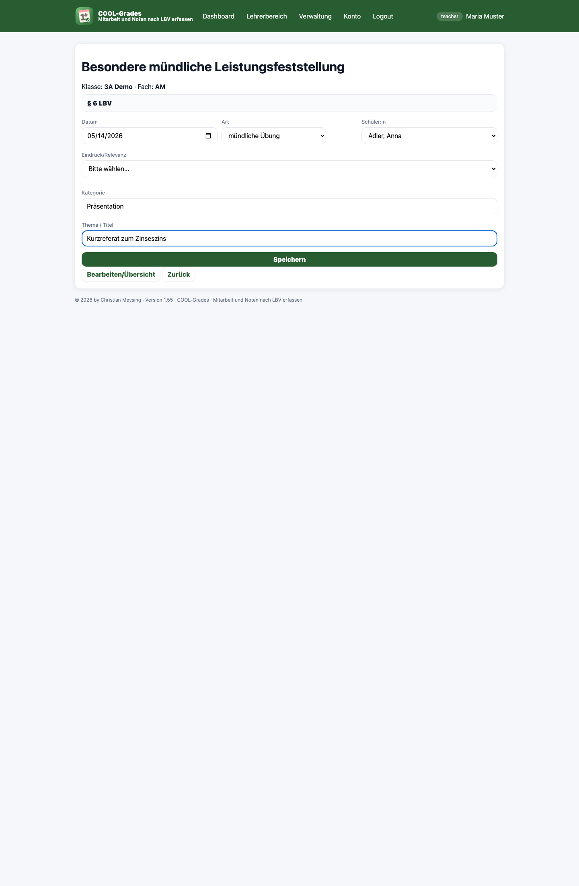

### Wann wird dieser Bereich verwendet?

Dieser Bereich ist für **besondere mündliche Leistungsfeststellungen** gedacht, also nicht für die gewöhnliche laufende Mitarbeit, sondern für formellere mündliche Leistungen.

Die App unterscheidet dabei zwischen:

- **mündliche Prüfung**
- **mündliche Übung**

### Unterschied zur laufenden Mitarbeit

Die Mitarbeitserfassung dokumentiert viele kleine Unterrichtsbeobachtungen im Verlauf des Semesters.

Die besondere mündliche Leistungsfeststellung dokumentiert dagegen eine **eigenständige mündliche Leistungssituation**.

Auswirkung auf die Auswertung:

- Besondere mündliche Leistungen erscheinen in der Auswertung **getrennt** von der Mitarbeit.
- Sie ergänzen das Gesamtbild, werden aber nicht mit den Mitarbeitseinträgen vermischt.

### Art: mündliche Prüfung / mündliche Übung

Die Auswahl der Art verändert, **welche Detailfelder sichtbar sind** und wie der Eintrag später interpretiert wird.

#### mündliche Prüfung

Gedacht für gezielte mündliche Prüfungsformen.

Zusätzliche Felder:

- Themengebiet
- Fragen

Wirkung:

- Die Eintragung dokumentiert, worauf sich die Prüfung bezogen hat.
- In der Auswertung ist später besser nachvollziehbar, welche Stoffbereiche geprüft wurden.

#### mündliche Übung

Gedacht für vorbereitete oder zusammenhängende mündliche Leistungen, zum Beispiel Referate oder Kurzpräsentationen.

Zusätzliche Felder:

- Kategorie
- Thema/Titel

Wirkung:

- In der Auswertung wird sichtbar, um welche Art von mündlicher Übung es ging.

### Datum

Das Datum bestimmt, in welchem Zeitraum die Leistung später in der Auswertung erscheint.

### Schüler:in

Hier wird die Leistung einer konkreten Person zugeordnet.

Wirkung:

- Anders als bei der Mitarbeitserfassung wird hier in der Regel **einzelbezogen** dokumentiert.

### Eindruck/Relevanz

Auch hier wird die Tendenz der Leistung dokumentiert.

Wirkung:

- Der Eindruck erscheint später in den mündlichen Leistungsblöcken der Auswertung.
- Er wird getrennt von der laufenden Mitarbeit dargestellt.

### Details

Themengebiet, Fragen, Kategorie oder Titel sind für die spätere Nachvollziehbarkeit besonders wichtig.

Empfehlung:

- lieber kurz und fachlich präzise als sehr ausführlich
- nur so viel festhalten, dass der Eintrag später verständlich bleibt

### Wie erscheinen diese Einträge in Auswertung und PDF?

- als eigener Bereich für **besondere mündliche Leistungen**
- getrennt von Mitarbeit
- mit Datum, Art und Ergebnis/Tendenz

## 6. Besondere schriftliche Leistungsfeststellungen

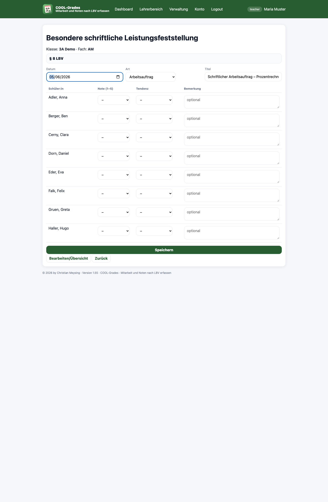

### Wann wird dieser Bereich verwendet?

Dieser Bereich ist für **besondere schriftliche Leistungsfeststellungen** gedacht. Die App unterscheidet mehrere Arten:

- Schularbeit
- Test
- schriftliche Wiederholung
- Arbeitsauftrag
- sonstige schriftliche Leistung

### Unterschied zur Mitarbeit

Schriftliche Leistungen sind formellere Leistungsfeststellungen mit klassischer Note und optionaler Tendenz oder Bemerkung. Sie werden in der Auswertung gesondert dargestellt und nicht als normale Mitarbeitseinträge gezählt.

### Art der schriftlichen Leistung

Die Auswahl `Art` bestimmt, wie die Leistung später benannt und eingeordnet wird.

#### Schularbeit

Diese Auswahl ist für schriftliche Leistungsformen gedacht, die als Schularbeit geführt werden.

Wirkung:

- In Auswertung und PDF wird der Eintrag klar als `Schularbeit` ausgewiesen.
- Wenn ein Fach als Schularbeitsfach interpretiert wird, bleibt zusätzlich der Hinweis bestehen, dass Schularbeitsleistungen gesondert zu berücksichtigen sind.

#### Test

Gedacht für kürzere schriftliche Überprüfungen.

Wirkung:

- In Auswertung und PDF erscheint die Leistung als `Test`.

#### Schriftliche Wiederholung

Gedacht für kleinere schriftliche Überprüfungen, die keine Schularbeit sind.

Wirkung:

- Die Leistung wird im Bericht nicht pauschal als Test, sondern bewusst als `Schriftliche Wiederholung` sichtbar.

#### Arbeitsauftrag

Gedacht für schriftliche Arbeitsaufträge oder Abgaben, die als besondere schriftliche Leistung dokumentiert werden sollen.

Wirkung:

- In Auswertung und PDF bleibt erkennbar, dass es sich nicht um einen klassischen Test, sondern um einen schriftlichen Auftrag handelt.

#### Sonstige schriftliche Leistung

Gedacht für schriftliche Leistungsformen, die in keine der anderen Kategorien passen.

Wirkung:

- Die Leistung wird als eigene Restkategorie dokumentiert, statt künstlich in Test oder Schularbeit eingeordnet zu werden.

### Datum

Bestimmt, ob die Leistung im gewählten Auswertungszeitraum erscheint.

### Titel

Der Titel beschreibt die konkrete Leistungsfeststellung, zum Beispiel:

- „Zinsrechnung“
- „Kapitel 3 – Wiederholung“
- „Arbeitsauftrag Kalkulation“

Wirkung:

- verbessert die Lesbarkeit in Überblick und PDF

### Note

Die Note ist das zentrale Ergebnisfeld.

Wirkung:

- Sie erscheint in Webauswertung und PDF
- mehrere schriftliche Leistungen werden dort kompakt zusammengefasst

Wichtig:

- Leere Felder werden nicht als negative Leistung interpretiert. Es wird nur gespeichert, was tatsächlich eingetragen wurde.

### Tendenz

Die Tendenz verfeinert die Note, zum Beispiel `plus` oder `minus`.

Wirkung:

- Sie erscheint gemeinsam mit der Note in Auswertung und PDF
- sie präzisiert den Eindruck, ohne eine neue eigene Note zu erzeugen

### Bemerkung

Die Bemerkung ergänzt die Leistung um einen kurzen sachlichen Hinweis.

Wirkung:

- Sie kann in späteren Detailansichten und PDFs wichtige Kontextinformationen liefern

### Wie erscheinen diese Einträge in Auswertung und PDF?

- als eigener Bereich für **besondere schriftliche Leistungen**
- getrennt von Mitarbeit und mündlichen Leistungen
- mit Art, Datum, Titel, Note, Tendenz und gegebenenfalls Bemerkung

### Wichtiger fachlicher Hinweis

Auch wenn Schularbeiten oder Tests dokumentiert werden, ersetzt die App nicht die vollständige Leistungsbeurteilung eines Unterrichtsgegenstandes. Besonders in Schularbeitsfächern bleiben Schularbeitsleistungen ein gesondert zu berücksichtigender Bestandteil.

## 7. Einträge suchen, prüfen und nachträglich bearbeiten

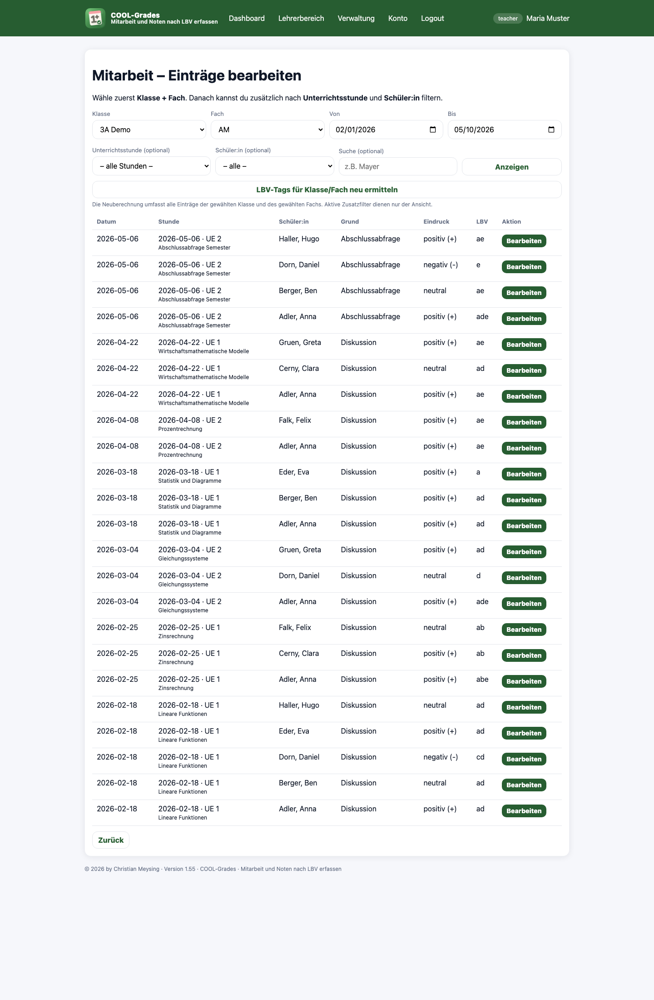

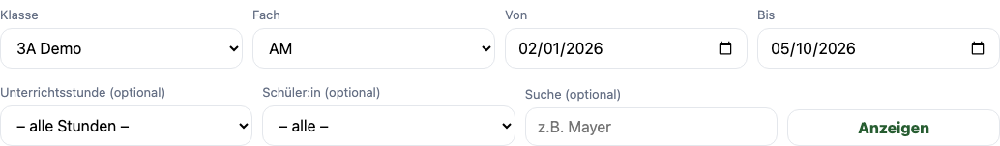

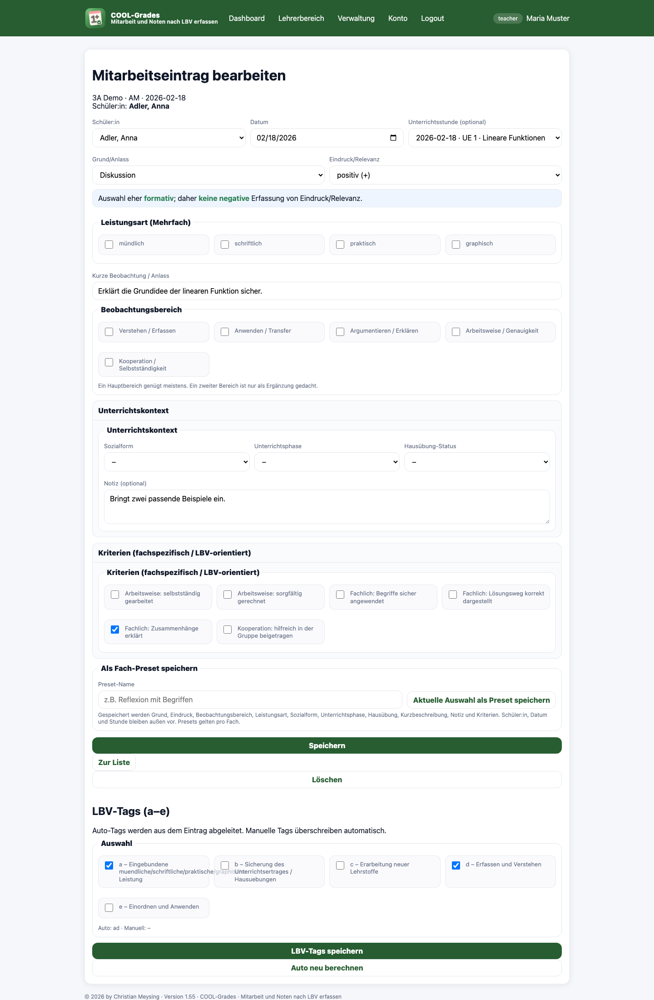

### Wo finde ich bestehende Einträge?

Im Lehrerbereich über **Einträge bearbeiten**.

Diese Seite zeigt die bereits gespeicherten Mitarbeitseinträge eines gewählten Fachs und einer gewählten Klasse. Von dort aus kann ein Eintrag geöffnet, angepasst oder gelöscht werden.

### Welche Filter gibt es?

Die Filter dienen nur dazu, **die angezeigte Liste einzugrenzen**. Sie verändern keine Daten.

### Klasse

- **Was filtert der Filter?**
  Nur Einträge dieser Klasse.
- **Welche Einträge werden angezeigt?**
  Nur zu dieser Klasse passende Mitarbeitseinträge.
- **Wirkt sich der Filter auf gespeicherte Daten aus?**
  Nein.

### Fach

- **Was filtert der Filter?**
  Nur Einträge dieses Fachs.
- **Welche Einträge werden angezeigt?**
  Nur Einträge, die für dieses Fach gespeichert wurden.
- **Wirkt sich der Filter auf gespeicherte Daten aus?**
  Nein.

### von / bis

- **Was filtert der Filter?**
  Den Datumsbereich.
- **Welche Einträge werden angezeigt?**
  Nur Einträge, deren Datum in diesem Zeitraum liegt.
- **Wirkt sich der Filter auf gespeicherte Daten aus?**
  Nein.

### Stunde

Die Stunden-Auswahl unterscheidet typischerweise:

- alle Stunden
- nur Einträge ohne Stunde
- eine konkrete Stunde

Wirkung:

- hilfreich, wenn mehrere Beobachtungen zu einer bestimmten UE oder einem bestimmten Thema geprüft werden sollen

### Schüler:in

Filtert die Liste auf eine einzelne Person.

Wirkung:

- sinnvoll, wenn Sie gezielt nur die Einträge einer Person prüfen oder korrigieren möchten

### Suche

Die Suche schränkt die sichtbare Liste zusätzlich nach Namen ein.

Wirkung:

- reine Ansichtshilfe
- keine Datenänderung

### Eintrag öffnen und bearbeiten

Im Bearbeitungsformular können wesentliche Felder nachträglich geändert werden, insbesondere:

- Datum
- Schüler:in
- Stunde
- Grund/Anlass
- Eindruck/Relevanz
- Beobachtungsbereich
- Leistungsart
- Unterrichtskontext
- kurze Beobachtung / Notiz
- Kriterien

Wirkung von Änderungen:

- Eine Änderung am **Datum** verschiebt den Eintrag in andere Auswertungszeiträume.
- Eine Änderung an **Schüler:in**, **Klasse** oder **Fach** verändert, wem der Eintrag später zugerechnet wird.
- Eine Änderung an **Eindruck/Relevanz** beeinflusst die Zählung positiv/neutral/negativ in der Auswertung.
- Änderungen an Beobachtungsbereich, Kriterien oder Notiz verbessern oder verändern die spätere Interpretation.

### LBV-Tags (a–e)

Im Bearbeitungsformular sind LBV-Tags sichtbar und bearbeitbar.

Sie stehen für:

- `a` eingebundene Leistung
- `b` Sicherung des Unterrichtsertrages / Hausübungen
- `c` Erarbeitung neuer Lehrstoffe
- `d` Erfassen und Verstehen
- `e` Einordnen und Anwenden

Wirkung:

- Die Tags helfen, Mitarbeit im Sinn der LBV inhaltlich einzuordnen.
- In der Detailauswertung und in späteren Übersichten können sie die fachliche Lesart schärfen.

Auto und manuell:

- Die App kann Auto-Tags aus dem Eintrag ableiten.
- Manuelle Tags überschreiben diese automatische Zuordnung.

Wichtig:

- Die Funktion `LBV-Tags für Klasse/Fach neu ermitteln` in der Eintragsliste verändert tatsächlich gespeicherte Auto-Tags für die gewählte Klasse und das gewählte Fach.
- Die übrigen Suchfilter auf der Seite schränken dabei nur die **Ansicht**, nicht die betroffene Datenmenge ein.

### Eintrag löschen

Ein gelöschter Mitarbeitseintrag steht danach für Auswertungen und PDFs nicht mehr zur Verfügung.

Wichtig:

- In der Lehrer:innenoberfläche gibt es keine sichtbare Wiederherstellung für gelöschte Mitarbeitseinträge.
- Löschen deshalb nur, wenn sicher ist, dass der Eintrag nicht mehr benötigt wird.

### Typische Fehler vermeiden

- vor dem Speichern das Datum prüfen
- vor dem Bearbeiten auf Klasse und Fach achten
- bei Korrekturen von Eindruck/Relevanz bewusst prüfen, ob sich damit die spätere Tendenz ändert
- bei Löschungen lieber kurz innehalten, weil es keine sichtbare Rückgängig-Funktion gibt

## 8. Verwaltung der eigenen Benutzerumgebung

Dieser Abschnitt betrifft nur Funktionen, die Lehrkräfte in ihrer **eigenen Arbeitsumgebung** nutzen können.

### 8.1 Kriterien verwalten

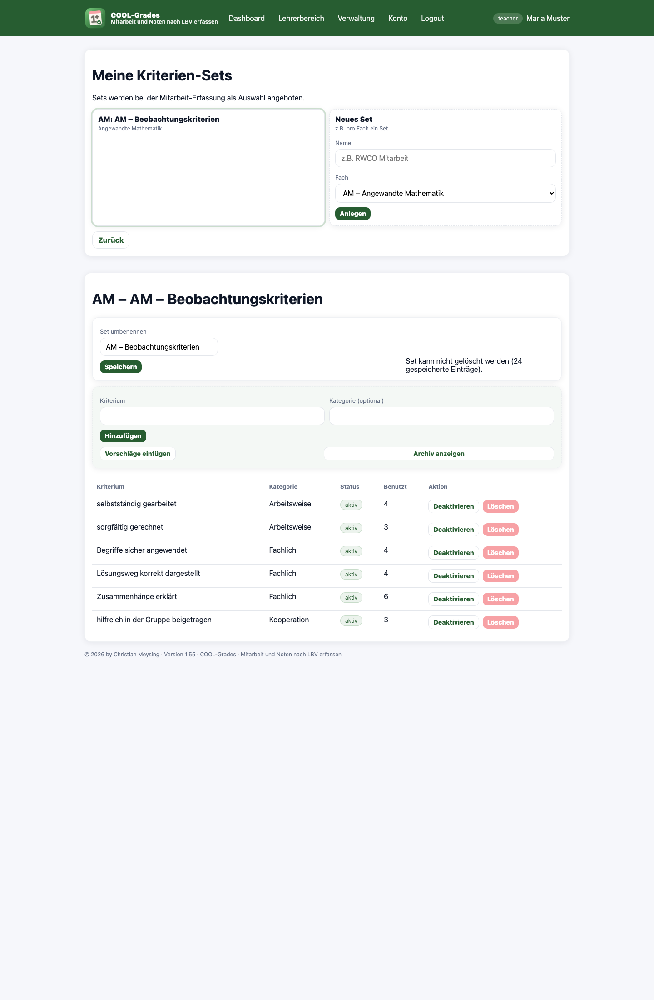

#### Was ist ein Kriterium?

Ein Kriterium ist ein fachlicher Detailbaustein, der eine Mitarbeitssituation genauer beschreibt. Kriterien werden in der Mitarbeitserfassung unter `Kriterien (fachspezifisch / LBV-orientiert)` angeboten.

#### Wofür werden Kriterien verwendet?

- zur fachlichen Feindifferenzierung
- für einheitliche Fachsprache im Kollegium oder in einem Fach
- für präzisere spätere Auswertungen

#### Was bewirkt ein neues Kriterium?

Ein neues Kriterium steht künftig in der Mitarbeitserfassung für das zugehörige Fach zur Auswahl bereit.

Es bewirkt **keine** automatische Bewertung. Es erweitert nur die Auswahlmöglichkeiten für neue Einträge.

#### Was passiert beim Bearbeiten eines Kriteriums?

- Änderungen verbessern vor allem die spätere Auswahl und Lesbarkeit.
- Bereits vorhandene Einträge bleiben als historische Dokumentation erhalten.

#### Was passiert beim Deaktivieren?

- Das Kriterium steht für neue Einträge nicht mehr im Vordergrund.
- Alte Einträge, die das Kriterium schon verwendet haben, verlieren dadurch nicht automatisch ihre Bedeutung.

#### Was passiert beim Löschen?

- Bereits verwendete Kriterien werden nicht einfach spurlos entfernt, sondern archiviert.
- Nicht verwendete Kriterien können endgültiger entfernt werden.

#### Empfehlung

- lieber wenige, klare Kriterien als sehr viele ähnliche
- Kriterien nicht als Ersatz für die Alltagsebene verwenden
- nur solche Kriterien anlegen, die im Unterricht wirklich wiederkehren

### 8.2 Picklisten verwalten

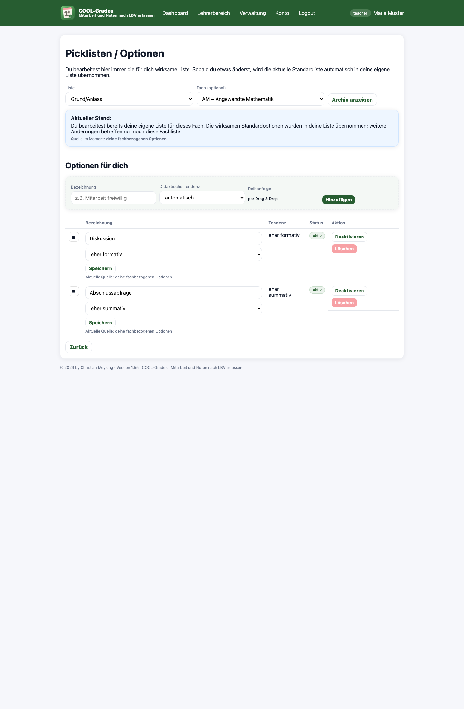

#### Was ist eine Pickliste?

Picklisten liefern die auswählbaren Einträge für Felder wie:

- Grund/Anlass
- Eindruck/Relevanz
- Leistungsart
- Sozialform
- Unterrichtsphase
- Hausübung-Status

#### Was bewirkt ein neuer Picklisteneintrag?

Ein neuer Eintrag steht in künftigen Formularen als Auswahl bereit und macht die Eingabe schneller und einheitlicher.

#### Was bewirkt das Sortieren?

Die Reihenfolge der Einträge im Formular ändert sich. Das ist vor allem dann hilfreich, wenn häufig genutzte Begriffe weiter oben stehen sollen.

#### Was bewirkt das Deaktivieren oder Archivieren?

- Der Eintrag steht für neue Auswahlen nicht mehr im Vordergrund.
- Historische Einträge werden dadurch nicht automatisch unbrauchbar.

#### Besonderheit bei Grund/Anlass

Für `Grund/Anlass` kann zusätzlich eine didaktische Tendenz hinterlegt werden, zum Beispiel eher formativ oder eher summativ.

Wirkung:

- Diese Tendenz beeinflusst den kurzen pädagogischen Hinweis im Mitarbeitsformular.
- Sie verändert **nicht** automatisch die positive oder negative Bewertung eines Eintrags.

#### Werden alte Einträge rückwirkend verändert?

Die Picklistenverwaltung ist vor allem für künftige Eingaben gedacht. Historische Einträge bleiben grundsätzlich Dokumentation ihrer damaligen Auswahl. Sie werden nicht dadurch neu bewertet, dass Sie später eine Pickliste umsortieren.

### 8.3 Presets verwenden

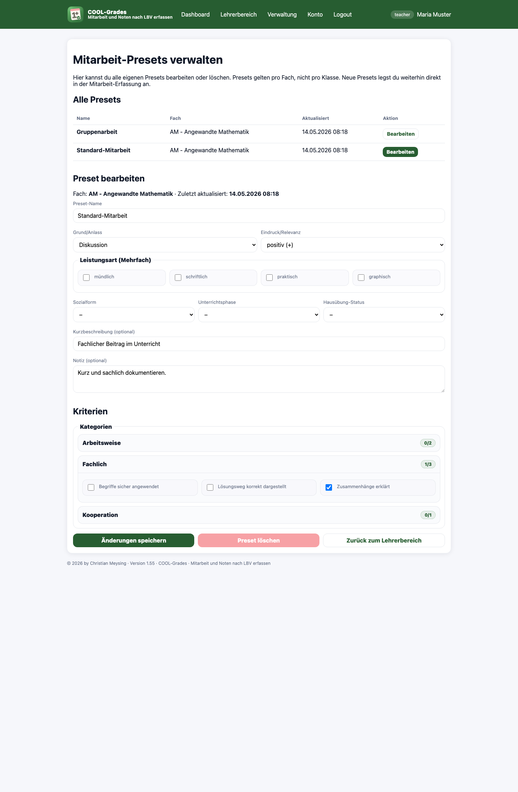

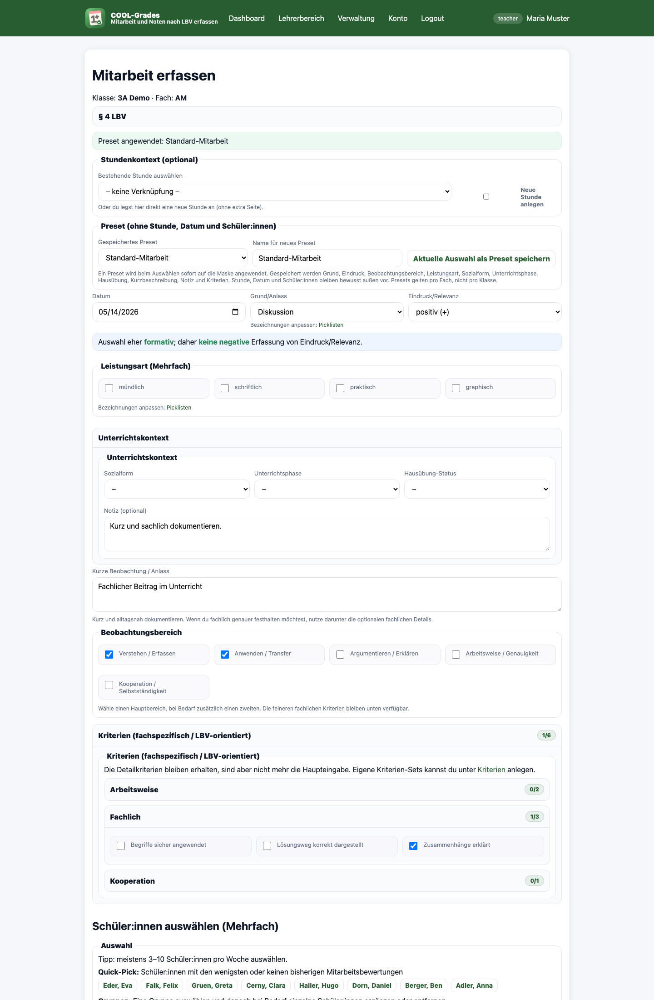

#### Was ist ein Preset?

Ein Preset ist eine vorbereitete Kombination typischer Eingaben für die Mitarbeitserfassung.

#### Was bewirkt das Anwenden eines Presets?

- Das Formular wird vorausgefüllt.
- Es wird **noch kein** neuer Eintrag gespeichert.
- Sie können die vorgeschlagenen Werte danach weiter anpassen.

#### Welche Felder werden typischerweise vorausgefüllt?

- Grund/Anlass
- Eindruck/Relevanz
- Beobachtungsbereich
- Leistungsart
- Unterrichtskontext
- kurze Texte
- Kriterien

#### Welche Felder werden typischerweise nicht festgelegt?

- Datum
- konkrete Schüler:innen
- konkrete Stunde

#### Wann sind Presets hilfreich?

- wenn bestimmte Unterrichtssituationen oft wiederkehren
- wenn mehrere ähnliche Einträge schnell vorbereitet werden sollen

#### Praxisbeispiele

- Standard-Mitarbeit
- Gruppenarbeit
- Präsentation
- Hausübung
- schriftlicher Arbeitsauftrag

### 8.4 Gruppenverwaltung

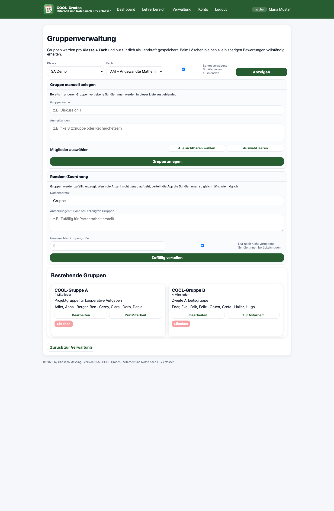

#### Wozu dienen Gruppen?

Gruppen sind eine **Auswahlhilfe** innerhalb einer Klasse und eines Fachs. Sie helfen, häufig gemeinsam beobachtete Schüler:innen schnell zu markieren.

Typische Beispiele:

- Projektgruppen
- COOL-Gruppen
- Fördergruppen
- Sitzgruppen

#### Wie unterscheiden sich Gruppen von Klassen?

- Eine **Klasse** ist die eigentliche Zugehörigkeit der Schüler:innen.
- Eine **Gruppe** ist eine von der Lehrkraft frei gebildete Teilmenge innerhalb von Klasse und Fach.

#### Wo werden Gruppen verwendet?

- in der Gruppenverwaltung zum Aufbau der Auswahl
- in der Mitarbeitserfassung als schnelle Vorauswahl von Schüler:innen

#### Was bewirkt eine Gruppe in der Mitarbeitserfassung?

Beim Anwenden einer Gruppe werden die zugeordneten Schüler:innen im Formular vorausgewählt. Danach können Sie einzelne Personen noch ergänzen oder abwählen.

Wichtig:

- Eine Gruppe speichert **keine** Bewertung.
- Sie erleichtert nur die Auswahl.

#### Was passiert beim Hinzufügen oder Entfernen von Schüler:innen?

- Künftige Gruppenauswahlen ändern sich entsprechend.
- Bereits gespeicherte Mitarbeitseinträge bleiben unverändert.

#### Was bewirkt die Option „Schon vergebene Schüler:innen ausblenden“?

Sie verbessert die Übersicht beim Anlegen weiterer Gruppen. Schüler:innen, die bereits in vorhandenen Gruppen zugeordnet sind, können aus der aktuellen Auswahl ausgeblendet werden.

Wirkung:

- nur Auswahlhilfe
- keine Veränderung an bestehenden Gruppen oder Bewertungen

#### Was bewirkt die Random-Zuordnung?

Die Random-Zuordnung teilt Schüler:innen zufällig in Gruppen auf. Vorher wird die gewünschte Gruppengröße festgelegt.

Wirkung:

- hilfreich, wenn schnell ausgeglichene Gruppen benötigt werden
- die App verteilt so gleichmäßig wie möglich, falls die Zahl nicht exakt aufgeht

#### Was passiert beim Löschen einer Gruppe?

- Die Gruppe verschwindet als Auswahlhilfe.
- Bereits gespeicherte Bewertungen bleiben vollständig erhalten.

## 9. Fächer und Schularbeitsstatus

### Warum erscheint dieser Status?

In der Auswertung kann sichtbar sein, ob ein Fach als

- `Schularbeitsfach: Ja`
- `Schularbeitsfach: Nein`
- `Nicht festgelegt`

geführt wird.

### Was bedeutet der Status?

#### Schularbeitsfach: Ja

Die Mitarbeitsauswertung bleibt voll sichtbar, wird aber bewusst als **Teil- oder Tendenzhinweis** interpretiert. Die Auswertung erinnert zusätzlich daran, dass Schularbeitsleistungen gesondert zu berücksichtigen sind.

#### Schularbeitsfach: Nein

Die Mitarbeit und die erfassten besonderen Leistungen können eine stärkere Grundlage für die pädagogische Gesamtschau bilden.

#### Nicht festgelegt

Die Auswertung funktioniert trotzdem, zeigt aber einen Prüfhinweis. Damit wird signalisiert, dass die Interpretation ohne diese Fachinformation weniger eindeutig ist.

### Was verändert der Schularbeitsstatus?

- die **Interpretation** der Auswertung
- die Hinweistexte in Webansicht und PDF

### Was verändert der Schularbeitsstatus nicht?

- er verändert **keine** Mitarbeitseinträge
- er verändert **nicht** die Zählung positiv/neutral/negativ
- er verändert **nicht** die Datenlage

### Wichtiger Hinweis für Lehrkräfte

In der Lehrer:innenrolle dient der Schularbeitsstatus vor allem als **Informationshinweis** in der Auswertung. Die App nutzt ihn, um die Berichte fachlich passender zu lesen. Er ist keine automatische Gewichtung von Noten.

## 10. Auswertung

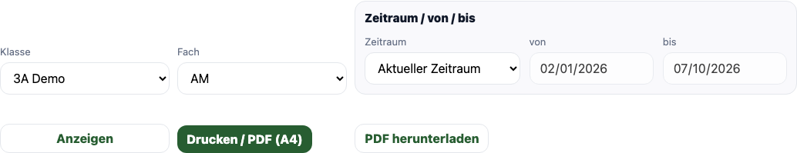

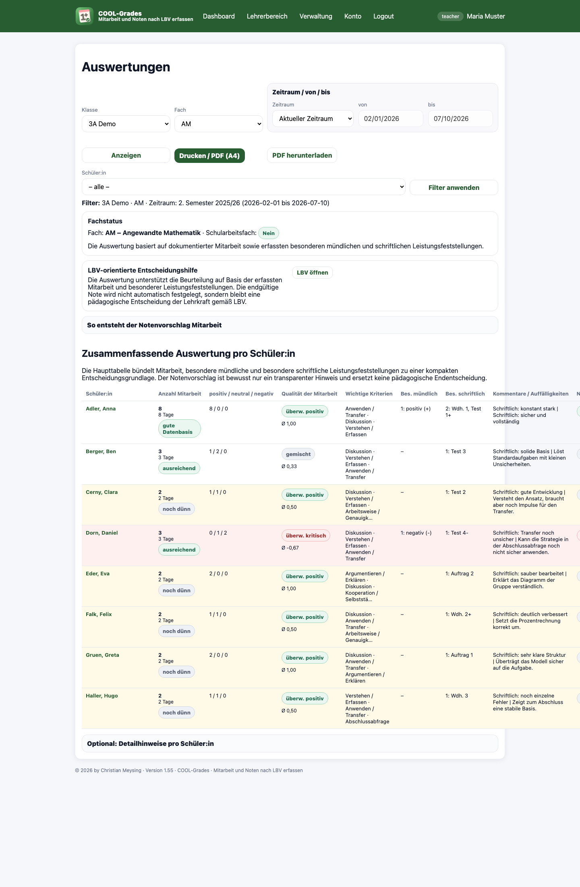

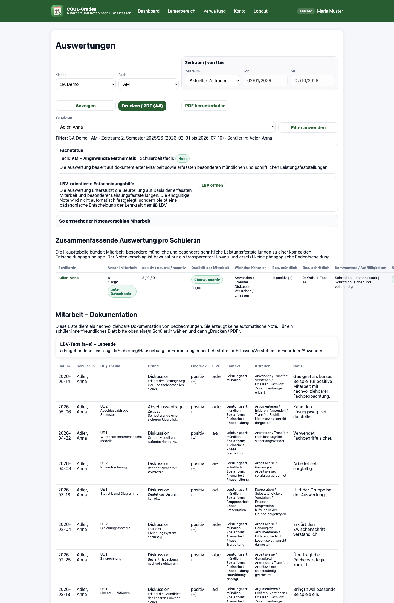

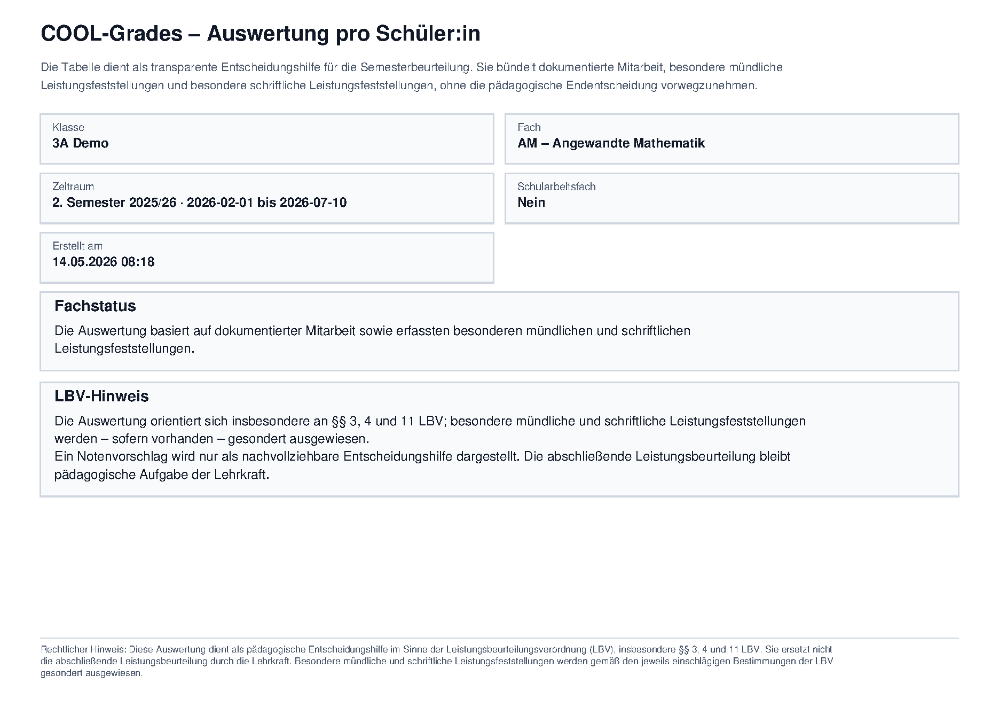

### Wo finde ich die Auswertung?

Über **Auswertungen** in der Hauptnavigation.

### Wofür ist die Auswertung gedacht?

Die Auswertung fasst dokumentierte Mitarbeit und besondere Leistungsfeststellungen pro Schüler:in zusammen. Sie soll am Ende eines Zeitraums helfen,

- Datenlage zu prüfen,
- Tendenzen zu erkennen,
- besondere Auffälligkeiten zu sehen,
- und die Mitarbeitsbeurteilung nachvollziehbar vorzubereiten.

### Welche Filter gibt es?

Alle Filter wirken nur auf die **angezeigte** oder **exportierte** Auswertung. Sie verändern keine gespeicherten Daten.

### Klasse

Legt fest, für welche Klasse die Auswertung erstellt wird.

Wirkung:

- Nur Daten dieser Klasse werden berücksichtigt.

### Fach

Legt fest, für welches Fach die Auswertung erstellt wird.

Wirkung:

- Nur Daten dieses Fachs werden berücksichtigt.

### Zeitraum

Der Zeitraum bestimmt, welche Daten in die Auswertung einfließen. Je nach Konfiguration können Auswahlmöglichkeiten wie aktueller Zeitraum, Semester, Schuljahr oder benutzerdefinierte Zeiträume angeboten werden.

Wirkung:

- Nur Einträge im gewählten Zeitraum werden in Tabelle und PDF berücksichtigt.

### von / bis

Diese Felder verfeinern oder setzen den Zeitraum.

Wirkung:

- Sie steuern exakt, welche Mitarbeitseinträge und besonderen Leistungen einbezogen werden.

### Schüler:in

Wenn eine einzelne Schüler:in gewählt wird, zeigt die Auswertung neben der Haupttabelle auch eine ausführlichere Detailansicht.

Wirkung:

- hilfreich für Elterngespräche, Einzelbeurteilungen oder Vorbesprechungen

### Was zeigt die Haupttabelle?

Die Haupttabelle zeigt pro Schüler:in unter anderem:

- Anzahl Mitarbeitseinträge
- Anzahl dokumentierter Tage
- positive, neutrale und negative Einträge
- Tendenz der Mitarbeit
- wichtige Kriterien
- besondere mündliche Leistungen
- besondere schriftliche Leistungen
- Kommentare / Auffälligkeiten
- Notenvorschlag Mitarbeit
- pädagogischen Hinweis

### Wie wird die Datenlage gelesen?

Die App unterscheidet die Datenlage bewusst, damit nicht aus zu wenigen Beobachtungen eine zu starke Aussage entsteht.

#### 0 Einträge

`Keine Daten vorhanden`

Wirkung:

- Die App gibt keine belastbare Einschätzung aus.

#### 1 bis 2 dokumentierte Tage oder Einträge

`Datenlage noch dünn`

Wirkung:

- Die App signalisiert, dass eine Einschätzung nur vorsichtig gelesen werden sollte.

#### ab 3 dokumentierten Tagen oder verwertbaren Einträgen

`Einschätzung möglich`

Wirkung:

- Es liegt eine erste tragfähige Grundlage vor.

#### bei mehreren dokumentierten Tagen

`gute Datenbasis`

Wirkung:

- Die Mitarbeitstendenz ist deutlich belastbarer.

### Wie werden positive, neutrale und negative Einträge gezählt?

- `positiv (+)` zählt als positiver Eintrag
- `neutral` zählt als neutraler Eintrag
- `negativ (-)` zählt als negativer Eintrag

Wichtig:

- `positiv (+)` darf nicht als neutral gelesen werden
- fehlende besondere schriftliche Leistungen werden nicht automatisch negativ gewertet

### Wie werden besondere mündliche und schriftliche Leistungen angezeigt?

Sie erscheinen getrennt von der Mitarbeit.

Wirkung:

- Mitarbeit bleibt als eigener Bereich lesbar
- besondere Leistungen ergänzen das Bild, ohne in die reine Mitarbeitsliste „hineinzurutschen“

### Was bedeutet der Notenvorschlag Mitarbeit?

Der Notenvorschlag bezieht sich ausdrücklich auf die **dokumentierte Mitarbeit** im gewählten Zeitraum. Er ist eine transparente Entscheidungshilfe.

Wirkung:

- Er soll die Lehrkraft bei der Strukturierung unterstützen.
- Er ersetzt keine pädagogische Gesamtschau.

### Was beeinflusst den PDF-Export?

Das PDF übernimmt die aktuell gesetzten Filter:

- Klasse
- Fach
- Zeitraum
- von / bis
- optional Schüler:in

Wirkung:

- Was Sie in der Filterung vorbereiten, wird so in den PDF-Bericht übertragen.

## 11. Semester- und Jahresbeurteilung festlegen

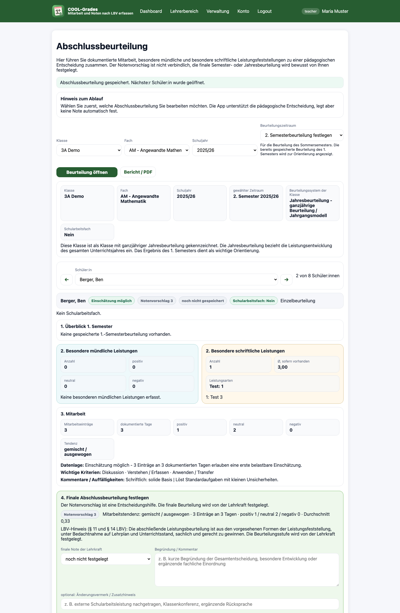

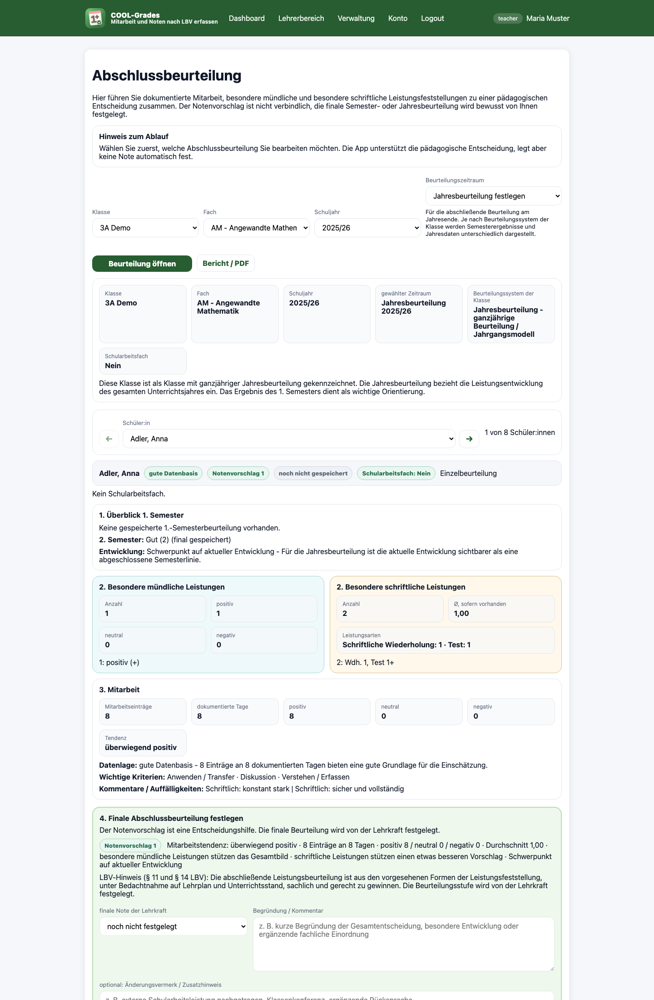

### Wozu dient dieser Bereich?

Die **Abschlussbeurteilung** ist der Schritt zwischen Auswertung und endgültiger pädagogischer Entscheidung. Hier wird nicht nur gelesen, sondern eine bewusst gewählte **Semesterbeurteilung** oder **Jahresbeurteilung** gespeichert.

Die App bleibt dabei ausdrücklich **keine Notenmaschine**:

- sie fasst zusammen,
- sie zeigt einen Notenvorschlag,
- sie dokumentiert die Entscheidungsgrundlage,
- die **finale Note** wird aber durch die Lehrkraft ausgewählt und gespeichert.

### Unterschied zwischen Auswertung und Abschlussbeurteilung

**Auswertung** bedeutet:

- vorhandene Daten sichten,
- Tendenzen lesen,
- Datenlage prüfen,
- PDF als Entscheidungshilfe nutzen.

**Abschlussbeurteilung** bedeutet:

- für einen klar gewählten Zeitraum eine endgültige pädagogische Entscheidung festhalten,
- den Notenvorschlag bewusst annehmen oder davon abweichen,
- Kommentar oder Begründung ergänzen,
- den Entscheidungsstand als Entwurf oder final speichern.

### Wo finde ich den Bereich?

Über **Lehrerbereich → Abschlussbeurteilung**.

### Welche Auswahlfelder gibt es?

### Klasse

Legt fest, für welche Klasse die Abschlussbeurteilung vorbereitet wird.

Wirkung:

- Nur Schüler:innen dieser Klasse werden angezeigt.
- Die Auswahl ändert keine Daten, sondern nur die aktuell bearbeitete Übersicht.
- Klassen sind schuljahresbezogen. Eine Klasse aus dem Vorjahr bleibt mit ihrer damaligen Bezeichnung erhalten.
- Wenn der Admin einen Schuljahreswechsel durchgeführt hat, wird für das neue Schuljahr eine neue Klasseninstanz verwendet. Alte Leistungsdaten bleiben bei der Vorjahresklasse.

### Fach

Legt das Fach fest, für das die Beurteilung vorgenommen wird.

Wirkung:

- Mitarbeit, besondere mündliche und besondere schriftliche Leistungen werden nur aus diesem Fach zusammengeführt.

### Schuljahr

Hier wird das gespeicherte Schuljahr gewählt.

Wirkung:

- Das Schuljahr bestimmt, welche Semestergrenzen und welcher Jahreszeitraum gelten.
- Es ändert keine gespeicherten Leistungsdaten, sondern nur die zeitliche Zuordnung der Auswertung und späteren Abschlussbeurteilung.
- Frühere Schuljahre können weiterhin ausgewählt werden, wenn Sie dafür eine Klassen-/Fachzuordnung besitzen.
- Vorjahresklassen sind als Archiv erkennbar. Sie dienen der Einsicht, Auswertung und dem PDF-Export; neue Einträge sind dort in der Regel gesperrt.

### Beurteilungszeitraum

Mögliche Auswahl:

- `1. Semesterbeurteilung festlegen`
- `2. Semesterbeurteilung festlegen`
- `Jahresbeurteilung festlegen`

Wirkung:

- `1. Semesterbeurteilung festlegen` ist für das Wintersemester gedacht und speichert die Abschlussbeurteilung für Semester 1.
- `2. Semesterbeurteilung festlegen` ist für das Sommersemester gedacht und zeigt gespeicherte 1.-Semesterstände zur Orientierung.
- `Jahresbeurteilung festlegen` fasst das Schuljahr zusammen und zeigt gespeicherte Semesterstände, sofern vorhanden.

Wichtig:

- Die Jahresbeurteilung wird **nicht automatisch als Durchschnitt** aus zwei Semestern gebildet.

### Beurteilungssystem der Klasse (SOST / NOST / Jahresbeurteilung)

In der Abschlussbeurteilung wird der zur Klasse gespeicherte Status sichtbar angezeigt:

- `SOST – semestrierte Oberstufe`
- `NOST – neue Oberstufe / semestrierte Beurteilung`
- `Jahresbeurteilung – ganzjährige Beurteilung / Jahrgangsmodell`

Wirkung:

- Das Beurteilungssystem ändert **keine** vorhandenen Leistungsdaten.
- Es steuert die **Interpretation** und die Hinweise im Entscheidungsworkflow.
- Bei `2. Semesterbeurteilung festlegen` und `Jahresbeurteilung festlegen` wird der 1.-Semesterstand pro Schüler:in zur Orientierung angezeigt.

### Wie ist die Bearbeitung aufgebaut?

Nach der Auswahl von Klasse, Fach, Schuljahr und Zeitraum steht bewusst **eine einzelne Schüler:in** im Zentrum.

Die Seite ist von oben nach unten so aufgebaut:

1. **Kontext**
   Klasse, Fach, Schuljahr, Beurteilungszeitraum, Beurteilungssystem und Schularbeitsstatus.
2. **Schüler:innen-Navigation**
   Pfeil nach links, Schüler:innen-Auswahl und Pfeil nach rechts.
3. **Bewertungsbereich**
   Einzelne Kästchen für Semesterüberblick, besondere Leistungen, Schularbeitsstatus, Mitarbeit und finale Entscheidung.

Wirkung:

- Die Lehrkraft beurteilt immer eine Person nach der anderen.
- Die Seite bleibt ruhig und vermeidet eine überladene Klassenübersicht.
- Die Beurteilung kann trotzdem schnell fortgesetzt werden, weil der Wechsel zwischen Schüler:innen direkt über Pfeile oder die Auswahl möglich ist.

### Wie wechsle ich zwischen Schüler:innen?

Der Wechsel erfolgt direkt oberhalb der Bewertungsbereiche:

- Mit `←` öffnen Sie die vorherige Schüler:in.
- Mit `→` öffnen Sie die nächste Schüler:in.
- In der Schüler:innen-Auswahl können Sie gezielt eine Person auswählen; die Seite springt automatisch dorthin.

Die Auswahl von Klasse, Fach, Schuljahr und Zeitraum bleibt dabei erhalten.

### Was zeigt der Bewertungsbereich?

Der Detailbereich folgt einer festen Reihenfolge:

1. `Überblick 1. Semester`
2. `Besondere mündliche Leistungen` und `Besondere schriftliche Leistungen` nebeneinander
3. `Mitarbeit`
4. `Finale Abschlussbeurteilung festlegen`

Wirkung:

- Die Lehrkraft sieht zuerst die Vorinformationen und erst danach den Entscheidungsbereich.
- Die finale Entscheidung basiert auf einer klaren, nachvollziehbaren Reihenfolge.

### Was bedeutet die Datenlage hier?

Die Datenlage folgt derselben Logik wie in der Auswertung:

- `Keine Daten vorhanden`
- `Datenlage noch dünn`
- `Einschätzung möglich`
- `gute Datenbasis`

Wirkung:

- Sie steuert nicht automatisch die Note.
- Sie hilft einzuschätzen, wie belastbar der Vorschlag im gewählten Zeitraum ist.

### Was bedeutet der Notenvorschlag?

Der **Notenvorschlag** ist eine transparente Entscheidungshilfe. Er berücksichtigt insbesondere:

- Mitarbeitstendenz
- Anzahl dokumentierter Tage
- Verteilung positiv / neutral / negativ
- besondere mündliche Leistungen
- in Nicht-Schularbeitsfächern auch schriftliche Leistungsfeststellungen
- Schularbeitsstatus in der Kopfzeile
- bei Jahresbeurteilung zusätzlich die sichtbare Entwicklung über das Schuljahr

Wichtig:

- Der Vorschlag ist **nicht verbindlich**.
- Bei dünner Datenlage wird bewusst kein harter Vorschlag erzwungen.
- Dann erscheinen Hinweise wie `Datenlage prüfen` oder `pädagogische Entscheidung erforderlich`.

### Was bedeutet finale Note?

Die **finale Note der Lehrkraft** ist die bewusst ausgewählte Abschlussbeurteilung.

Auswahlmöglichkeiten:

- `Sehr gut (1)`
- `Gut (2)`
- `Befriedigend (3)`
- `Genügend (4)`
- `Nicht genügend (5)`
- `noch nicht festgelegt`

Wirkung:

- Erst diese Auswahl wird gespeichert.
- Der Notenvorschlag allein verändert noch nichts.

### Wozu dient Begründung / Kommentar?

Im unteren Entscheidungsbereich wird die finale Note festgelegt. Dazu gehört ein Feld für **Begründung / Kommentar**.

Sinnvoll ist dieses Feld zum Beispiel für:

- eine kurze Begründung, warum die gewählte Note pädagogisch passt,
- einen Hinweis auf eine sichtbare Entwicklung,
- die Einordnung externer oder zusätzlicher Leistungsfeststellungen,
- eine Erinnerung für spätere Gespräche oder Konferenzen.

Wirkung:

- Der Kommentar wird mit der Abschlussbeurteilung gespeichert.
- Er erscheint später auch im Bericht / PDF.
- Wenn Sie bewusst vom Vorschlag abweichen, hilft der Kommentar bei der Nachvollziehbarkeit.

### Was bedeutet Status?

Es gibt zwei Arbeitsstände:

- `Entwurf`
- `final gespeichert`

#### Entwurf speichern

Sinnvoll, wenn

- die Note noch nicht endgültig feststeht,
- noch externe Leistungen einzubeziehen sind,
- oder die Übersicht vorbereitet werden soll.

Wirkung:

- Die gewählte Note und der Kommentar werden zwischengespeichert.
- Die Entscheidung bleibt weiter bearbeitbar.
- Nach erfolgreichem Speichern öffnet die App automatisch die nächste Schüler:in.

#### Final speichern

Sinnvoll, wenn die pädagogische Entscheidung bewusst getroffen wurde.

Wirkung:

- Die Abschlussbeurteilung wird als final gespeichert.
- Die App dokumentiert die zugrunde liegende Datenlage als Momentaufnahme.
- Nach erfolgreichem Speichern öffnet die App automatisch die nächste Schüler:in.

### Welche Kästchen sind für die Entscheidung besonders wichtig?

#### Überblick zur Datenlage

Zeigt auf einen Blick:

- Anzahl der Mitarbeitseinträge
- dokumentierte Tage
- Datenlage
- Qualität der Mitarbeit

Wirkung:

- Dieses Kästchen hilft einzuschätzen, **wie tragfähig** die dokumentierte Grundlage im gewählten Zeitraum ist.

#### Mitarbeit

Zeigt:

- positiv / neutral / negativ / ohne Wertung
- wichtige Kriterien
- pädagogischen Hinweis

Wirkung:

- Hier wird sichtbar, welche Tendenz die dokumentierte Mitarbeit insgesamt hat.

#### Besondere mündliche Leistungen

Zeigt:

- Anzahl
- Verteilung positiv / neutral / negativ
- zusammengefasste Einordnung

Wirkung:

- Mündliche Sonderleistungen werden als eigener Bereich lesbar und gehen nicht in der allgemeinen Mitarbeit unter.

#### Besondere schriftliche Leistungen

Zeigt:

- Anzahl
- Durchschnitt, sofern vorhanden
- Art der schriftlichen Leistungen
- kurze Zusammenfassung

Wirkung:

- Der Bereich zeigt, welche schriftlichen Leistungsfeststellungen im gewählten Zeitraum tatsächlich dokumentiert wurden.
- Fehlende schriftliche Leistungen werden in Nicht-Schularbeitsfächern **nicht automatisch negativ** gewertet.

#### Schularbeitsstatus in der Kopfzeile

Zeigt:

- `Ja`
- `Nein`
- `Nicht festgelegt`

Wirkung:

- Der Status ändert **nicht** die erfassten Mitarbeitsdaten.
- Er verändert nur die **Interpretation** der Abschlussbeurteilung.
- Er erscheint nicht mehr als großer eigener Abschnitt, sondern kompakt beim Schüler:innen-Kopf.
- In der Abschlussbeurteilung steht er kompakt in der Kopfzeile der einzelnen Schüler:innen-Beurteilung.

#### Notenvorschlag der App

Zeigt:

- den Vorschlag selbst
- die kurze Begründung

Wirkung:

- Sie sehen nicht nur eine Zahl, sondern auch, **warum** der Vorschlag so ausfällt.

#### Semesterschau bei Jahresbeurteilung

Zeigt zusätzlich:

- den sichtbaren Stand von Semester 1
- den sichtbaren Stand von Semester 2
- die Entwicklung über das Schuljahr

Wirkung:

- Die Jahresbeurteilung wird nicht als Durchschnitt erzwungen.
- Stattdessen wird die Entwicklung pädagogisch sichtbar gemacht.

### Was ist bei Schularbeitsfächern wichtig?

Wenn ein Fach als Schularbeitsfach gekennzeichnet ist, erscheint ein klarer Hinweis.

Wirkung:

- Die App wertet die Mitarbeit weiterhin aus.
- Die App tut aber nicht so, als könne allein aus Mitarbeit die gesamte Semester- oder Jahresnote entstehen.
- Externe oder zusätzlich erfasste Schularbeitsleistungen müssen pädagogisch mitgedacht werden.

### Was ist bei Nicht-Schularbeitsfächern wichtig?

In Nicht-Schularbeitsfächern kann die Abschlussbeurteilung stärker auf Mitarbeit, besonderen mündlichen und vorhandenen schriftlichen Leistungsfeststellungen beruhen.

Wichtig:

- Fehlende Tests oder fehlende schriftliche Sonderleistungen werden **nicht automatisch negativ** gewertet.

### Was ist bei der Jahresbeurteilung besonders?

Im Modus `Jahresbeurteilung festlegen` zeigt die App zusätzlich:

- vorhandene Semesterstände
- Entwicklung zwischen 1. und 2. Semester
- Hinweise wie
  - `Jahrestendenz stabil positiv`
  - `deutliche Verbesserung im 2. Semester`
  - `Leistungsabfall im 2. Semester`
  - `Semesterleistungen uneinheitlich`

Wirkung:

- Die Entwicklung wird sichtbar gemacht.
- Es wird aber keine Durchschnittslogik erzwungen.

### Wie werden finale Abschlussbeurteilungen später geändert?

Bereits final gespeicherte Abschlussbeurteilungen bleiben bearbeitbar, aber mit zusätzlichem **Änderungsvermerk**.

Wirkung:

- Die App protokolliert, dass eine finale Entscheidung später nochmals verändert wurde.
- Damit bleibt nachvollziehbar, wann und durch wen eine Änderung erfolgt ist.

### Gibt es einen PDF-Bericht?

Ja. Über `Bericht / PDF` wird eine PDF-Fassung der Abschlussbeurteilung erzeugt.

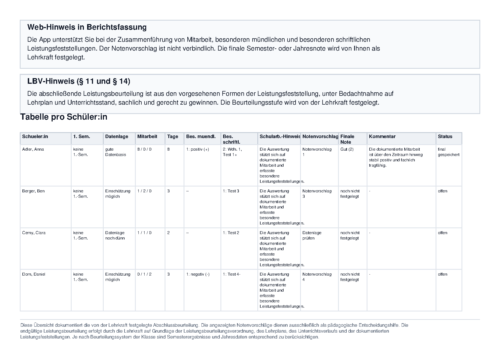

Der Bericht enthält unter anderem:

- Klasse
- Fach
- Schuljahr
- Zeitraum
- Schularbeitsfachstatus
- Tabelle pro Schüler:in
- Datenlage
- Notenvorschlag
- finale Note
- Kommentar
- Status
- rechtlich-pädagogischen Hinweis

### Pädagogischer Kern

Die Abschlussbeurteilung ist die Stelle, an der die App ihre stärkste Hilfe leistet:

- sie macht vorhandene Daten lesbar,
- sie strukturiert die Entscheidung,
- sie dokumentiert den Stand,
- aber sie ersetzt nicht die Verantwortung der Lehrkraft.

### Welcher LBV-Bezug ist hier besonders wichtig?

Für die Abschlussbeurteilung sind vor allem zwei Punkte wichtig:

- **§ 11 LBV**: Die Leistungsbeurteilung ist aus den vorgesehenen Formen der Leistungsfeststellung zu gewinnen und am Lehrplan sowie am Stand des Unterrichts auszurichten.
- **§ 14 LBV**: Die Note selbst wird als Beurteilungsstufe `Sehr gut (1)` bis `Nicht genügend (5)` festgelegt.

Wirkung in der App:

- Die App sammelt und strukturiert die vorhandenen Leistungsfeststellungen.
- Die **abschließende Note** wird aber bewusst von der Lehrkraft festgelegt.
- Genau deshalb trennt die App klar zwischen **Notenvorschlag** und **finaler Note**.

## 12. PDF-Export

### Was wird exportiert?

Das PDF exportiert die aktuell gefilterte Auswertung. Je nach Auswahl entsteht:

- eine zusammenfassende Klassenübersicht
- oder eine detailliertere Einzelansicht einer Schüler:in

### Welche Informationen erscheinen im PDF?

Je nach Filterstand unter anderem:

- Klasse
- Fach
- Zeitraum
- Schularbeitsstatus des Fachs
- Haupttabelle pro Schüler:in
- Mitarbeitsdaten
- besondere mündliche Leistungen
- besondere schriftliche Leistungen
- pädagogischer Hinweis
- LBV-Hinweis

### Welche Filter wirken auf das PDF?

Alle auf der Auswertungsseite gesetzten Filter wirken direkt auf den Export. Das PDF ist also **kein separates Parallel-System**, sondern eine Ausgabe der gerade gewählten Auswertung.

### Was bedeutet der LBV-Hinweis?

Der LBV-Hinweis erinnert daran, dass die Auswertung eine pädagogische Entscheidungshilfe im Sinne der Leistungsbeurteilungsverordnung ist. Er soll klarstellen:

- Die App strukturiert vorhandene Daten.
- Die endgültige Beurteilung bleibt bei der Lehrkraft.

### Wie kann das PDF genutzt werden?

Zum Beispiel:

- für die persönliche Vorbereitung auf Beurteilungen
- als Gesprächsgrundlage
- als übersichtliches Arbeitsblatt vor Konferenzen

### Welche Grenzen hat das PDF?

- Es bildet nur ab, was dokumentiert wurde.
- Es ersetzt keine pädagogische Gesamtbeurteilung.
- Es macht Daten sichtbar, aber nicht automatisch richtig, wenn Einträge zu knapp, zu selten oder fachlich unpassend sind.

## 13. Rechtlicher und pädagogischer Hintergrund

### Mitarbeit im Sinn der LBV

Die App orientiert sich an der Leistungsbeurteilungsverordnung, insbesondere daran, dass Mitarbeit eine Form der Leistungsfeststellung ist und den **Gesamtbereich der Unterrichtsarbeit** umfasst.

Wichtige Grundsätze in knapper Form:

- Einzelne Beobachtungen sind **keine Einzelnoten**
- dokumentiert werden soll nur so viel, wie für eine nachvollziehbare Beurteilung nötig ist
- Verhalten und fachliche Leistung sind zu trennen
- Beurteilung soll sachlich, nachvollziehbar und fair erfolgen

### Wozu passt die App pädagogisch gut?

Die App ist besonders hilfreich, wenn Lehrkräfte:

- regelmäßig, aber nicht übermäßig dokumentieren
- fachbezogene Beobachtungen kurz festhalten
- positive und negative Situationen ausgewogen eintragen
- am Ende eines Zeitraums auf eine nachvollziehbare Gesamtschau zurückgreifen möchten

### Was bleibt Aufgabe der Lehrkraft?

- Gewichtung im konkreten Unterricht
- fachliche Interpretation
- pädagogische Gesamtentscheidung

## 14. Gute Praxis der Mitarbeitsdokumentation

### Grundsätze

- fachbezogen dokumentieren
- kurz und sachlich schreiben
- beobachtbare Leistungen erfassen
- keine Persönlichkeitsurteile festhalten
- positive Mitarbeit bewusst mit dokumentieren
- negative Beobachtungen konkret und fair formulieren
- nicht jede Kleinigkeit erfassen
- über das Semester verteilt dokumentieren
- Qualität wichtiger nehmen als bloße Häufigkeit

### Vorher-Nachher-Beispiele

#### Beispiel 1

Schlecht:

- „Anna war unmotiviert.“

Besser:

- „Anna beginnt den Arbeitsauftrag erst nach Erinnerung; zentrale Fachfrage bleibt noch unklar.“

#### Beispiel 2

Schlecht:

- „Max stört.“

Besser:

- „Max beteiligt sich in der Gruppenphase kaum an der fachlichen Aufgabe; kein Ergebnisbeitrag erkennbar.“

#### Beispiel 3

Schlecht:

- „Sehr brav.“

Besser:

- „Löst die Übungsaufgaben selbstständig und erklärt den Lösungsweg korrekt.“

#### Beispiel 4

Schlecht:

- „Hat gut mitgemacht.“

Besser:

- „Bringt in der Sicherung zwei fachlich richtige Beispiele ein und ordnet sie korrekt dem Thema zu.“

#### Beispiel 5

Schlecht:

- „Unkonzentriert.“

Besser:

- „Kann die Fachbegriffe im Arbeitsauftrag noch nicht sicher anwenden und verliert dadurch den Lösungsweg.“

#### Beispiel 6

Schlecht:

- „Hausübung schlecht.“

Besser:

- „Hausübung unvollständig; die entscheidende Rechenstrategie wurde nicht nachvollziehbar dokumentiert.“

#### Beispiel 7

Schlecht:

- „War aktiv.“

Besser:

- „Beteiligt sich mehrfach mit passenden Fachbegriffen und stellt eine Rückfrage, die den Lösungsweg der Gruppe weiterführt.“

#### Beispiel 8

Schlecht:

- „Referat okay.“

Besser:

- „Präsentiert das Thema strukturiert, verwendet Fachbegriffe korrekt, die Begründung zum Beispiel bleibt aber noch knapp.“

### Praxistipp

Je konkreter die fachliche Beobachtung, desto hilfreicher ist sie später für Auswertung, PDF und Beurteilungsgespräch.

## 15. Problemlösungen / FAQ

### Ich sehe keine Klasse.

Wahrscheinlich ist für Ihr Konto aktuell keine passende Zuweisung sichtbar oder ausgewählt. Prüfen Sie zuerst, ob Sie im richtigen Bereich arbeiten. Wenn die Klasse grundsätzlich fehlt, ist das ein Fall für den Admin.

### Ich sehe keine Schüler:innen.

Prüfen Sie zuerst Klasse und Fach. In der Mitarbeitserfassung hängt die Schüler:innenliste direkt an dieser Kombination. Wenn dort alles stimmt und trotzdem keine Liste erscheint, sollte der Admin die Zuordnung prüfen.

### Ich finde einen Eintrag nicht.

Prüfen Sie:

- Klasse
- Fach
- von / bis
- Stunde
- Schüler:in
- Suchfeld

Häufig liegt es an einem zu engen Datumsfilter oder an einem falsch gewählten Fach.

### Die Auswertung zeigt „Datenlage noch dünn“.

Das bedeutet nicht zwingend, dass etwas kaputt ist. Es heißt nur, dass für die gewählte Person und den gewählten Zeitraum erst wenige dokumentierte Tage oder Einträge vorliegen.

### Positive Einträge erscheinen nicht wie erwartet.

Prüfen Sie, ob wirklich `positiv (+)` gespeichert wurde und ob der Zeitraum richtig gewählt ist. Die App zählt positive Eindrücke als positive Einträge; wenn sie nicht sichtbar sind, liegt es meist an Filterung oder Fach-/Datumswahl.

### Ich habe das falsche Datum gewählt.

Öffnen Sie den Eintrag über `Einträge bearbeiten` und korrigieren Sie das Datum. Beachten Sie, dass sich dadurch auch die Auswertungszuordnung ändert.

### Ich habe das falsche Fach gewählt.

Auch das lässt sich über das Bearbeiten bestehender Einträge korrigieren. Wichtig ist, dass sich dadurch die spätere Auswertung in einem anderen Fach verändert.

### Ich möchte ein Preset ändern.

Gehen Sie in die Verwaltung der Presets. Dort können bestehende Presets angepasst oder entfernt werden. Das ändert künftige Formularvorschläge, speichert aber nicht rückwirkend neue Bewertungen.

### Ich weiß nicht, ob ich Mitarbeit oder besondere Leistung erfassen soll.

Faustregel:

- **Mitarbeit** für laufende Unterrichtsbeobachtungen
- **besondere mündliche Leistung** für formellere mündliche Leistungen
- **besondere schriftliche Leistung** für Tests, Schularbeiten, Wiederholungen oder schriftliche Arbeitsaufträge

### Der PDF-Export sieht nicht wie erwartet aus.

Prüfen Sie zuerst die gesetzten Filter in der Webauswertung. Das PDF übernimmt genau diesen Stand.

### Wann sollte ich den Admin kontaktieren?

Wenn

- Klassen oder Fächer grundsätzlich fehlen
- Schüler:innen nicht vorhanden sind
- Zuweisungen offensichtlich nicht stimmen
- fachbezogene Grunddaten oder globale Einstellungen fehlen

## 16. Kurzanleitung

### Der typische Ablauf in 10 Schritten

1. Einloggen
2. Im Bereich `Konto` die persönliche Darstellung kurz prüfen
3. Im Lehrerbereich Klasse und Fach auswählen
4. Bei Bedarf Kriterien, Picklisten oder Presets vorbereiten
5. Mitarbeit schnell erfassen
6. Besondere mündliche oder schriftliche Leistungen separat erfassen
7. Einträge bei Bedarf über `Einträge bearbeiten` kontrollieren
8. Gruppen oder Presets für wiederkehrende Situationen nachschärfen
9. Auswertung mit passendem Zeitraum öffnen
10. Ergebnis pädagogisch interpretieren und nicht als Automatismus lesen

## 17. Screenshots in dieser Fassung

Die vorliegende Handbuchfassung enthält **echte Screenshots** aus einer lauffähigen Demo-Umgebung der App.

- Verwendet wurde ein lokaler Demo-Zugang in der Rolle **Lehrer:in**.
- Die Daten wurden vor der Aufnahme bewusst als **Demo-Daten** eingerichtet und enthalten keine realen Schüler:innendaten.
- Die Bilder zeigen reale Formulare, Listen, Auswertungen und den PDF-Export der App.
- Einzelne Screenshots wurden bewusst so gewählt, dass typische Arbeitszustände sichtbar werden, zum Beispiel ein ausgefülltes Mitarbeitsformular oder eine Detailauswertung pro Schüler:in.

Für spätere Aktualisierungen gilt:

- Die Screenshots lassen sich mit derselben Demo-Umgebung erneut erzeugen.
- Wenn sich Formulare oder Texte ändern, sollten die betroffenen Screenshots neu aufgenommen werden, damit Handbuch und App dieselbe Oberfläche zeigen.

## 18. Verwendete Screenshot-Sammlung

Die verwendeten Bilddateien liegen im Ordner:

- `docs/screenshots/lehrerhandbuch/`

Dort liegen unter anderem:

- Dashboard und Kontoeinstellungen
- Mitarbeitserfassung leer, ausgefüllt und gespeichert
- besondere mündliche und schriftliche Leistungsfeststellungen
- Eintragsliste und Bearbeiten
- Kriterien, Picklisten, Presets und Gruppenverwaltung
- Auswertungsfilter, Haupttabelle und Detailansicht
- PDF-Export-Schaltfläche sowie Beispiel-PDF
- Abschlussbeurteilung als Übersicht, Detailansicht und PDF-Bericht

Die Dateinamen sind bewusst sprechend gehalten, damit sie bei künftigen Überarbeitungen gezielt ersetzt werden können.

## 19. Offene Punkte / zu prüfen

- Der Schularbeitsstatus ist für Lehrkräfte in der Auswertung sichtbar, aber in dieser Rolle nicht selbst pflegbar. Im Handbuch ist er daher bewusst als Informationsfunktion beschrieben.
- Ein eigenes separates Vertiefungsdokument zum LBV-Bezug war in dieser Projektfassung nicht als unabhängige Handbuchquelle vorhanden; der rechtliche Hintergrund wurde deshalb direkt in dieses Handbuch integriert.
